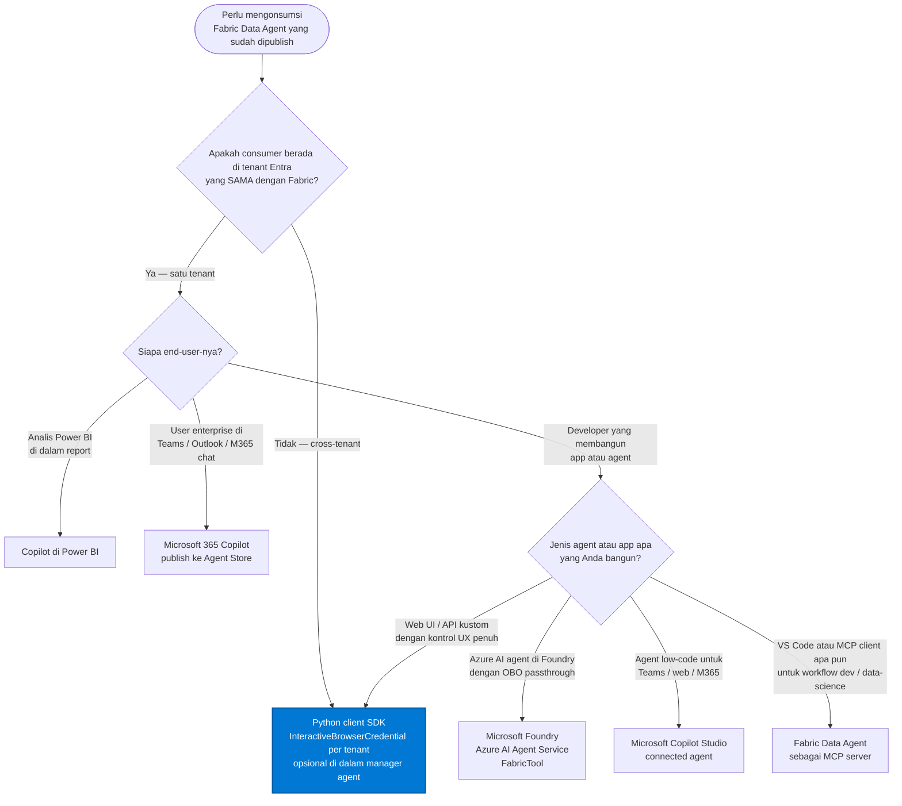
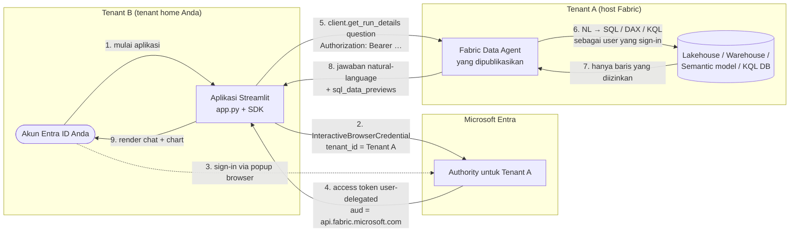
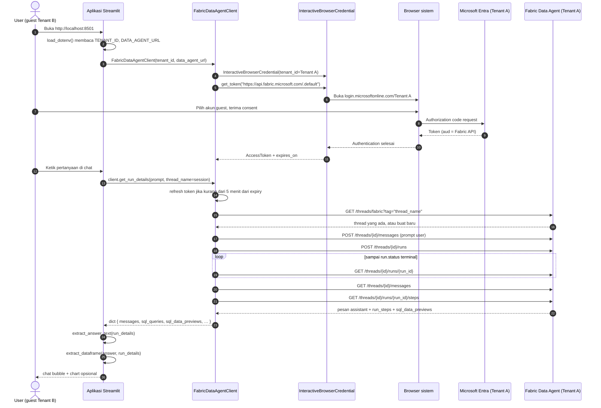
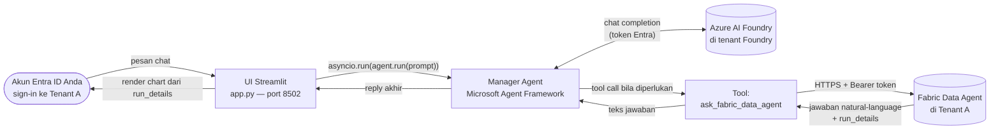
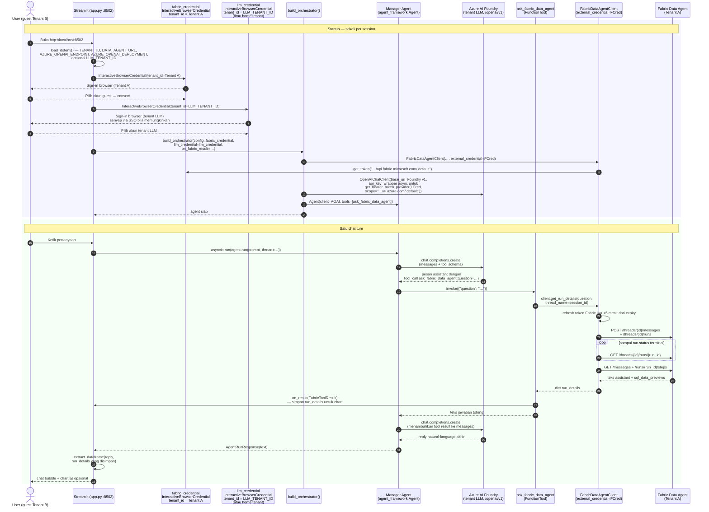

# Fabric Data Agent — Demo Cross-Tenant

**Bahasa:** [English](README.md) · **Bahasa Indonesia**

Repositori ini berisi **dua** demo Streamlit secara bertahap untuk skenario
cross-tenant yang sama: seorang pengguna di **Tenant B** mengonsumsi
**Microsoft Fabric Data Agent** yang dipublikasikan di **Tenant A**,
menggunakan sign-in interaktif Microsoft Entra ID (tanpa service principal,
tanpa middle-tier).

Implementasi mengikuti pola resmi dari Microsoft Learn:
**[Consume a Fabric data agent with the Python client SDK (preview)](https://learn.microsoft.com/fabric/data-science/consume-data-agent-python)**.

> **Catatan preview.** Microsoft Fabric Data Agent, Python client SDK-nya,
> dan Microsoft Agent Framework semuanya berstatus
> [Public Preview](https://learn.microsoft.com/fabric/fundamentals/preview).
> API, endpoint, dan perilakunya dapat berubah sewaktu-waktu.

> **Status.** Kedua demo sudah diverifikasi end-to-end. Demo orchestrator
> telah divalidasi pada konfigurasi cross-tenant sungguhan (Fabric di
> Tenant A, Azure AI Foundry di tenant yang berbeda) menggunakan dua
> instance `InteractiveBrowserCredential` dan variabel env opsional
> `LLM_TENANT_ID` — lihat [Referensi konfigurasi](#referensi-konfigurasi-nilai-env).

---

## Daftar isi

- [Pilih demo Anda](#pilih-demo-anda)
- [Cara mengonsumsi Fabric Data Agent](#cara-mengonsumsi-fabric-data-agent)
  - [Enam pola konsumsi resmi](#enam-pola-konsumsi-resmi)
  - [Decision tree — pola mana yang harus saya pakai?](#decision-tree--pola-mana-yang-harus-saya-pakai)
  - [Posisi kedua demo ini](#posisi-kedua-demo-ini)
- [Tata letak repositori](#tata-letak-repositori)
- [Arsitektur](#arsitektur)
  - [Model identitas cross-tenant bersama](#model-identitas-cross-tenant-bersama)
  - [Sequence detail — auth + satu chat turn (demo sederhana)](#sequence-detail--auth--satu-chat-turn-demo-sederhana)
  - [Arsitektur manager-agent (demo orchestrator)](#arsitektur-manager-agent-demo-orchestrator)
  - [Sequence detail — chat turn orchestrator](#sequence-detail--chat-turn-orchestrator)
- [Mengapa ini disebut "cross-tenant"](#mengapa-ini-disebut-cross-tenant)
- [Prasyarat](#prasyarat)
- [Mulai cepat](#mulai-cepat)
  - [Demo sederhana (`demo/`, port 8501)](#demo-sederhana-demo-port-8501)
  - [Demo orchestrator (`demo-orchestrator/`, port 8502)](#demo-orchestrator-demo-orchestrator-port-8502)
- [Referensi konfigurasi (`.env` values)](#referensi-konfigurasi-nilai-env)
- [Tes](#tes)
- [Rendering chart](#rendering-chart)
- [Catatan SDK vendored](#catatan-sdk-vendored)
- [Mengembangkan orchestrator](#mengembangkan-orchestrator)
- [Pemecahan masalah](#pemecahan-masalah)
- [Referensi Microsoft Learn](#referensi-microsoft-learn)
- [Lisensi](#lisensi)

---

## Pilih demo Anda

| Folder | Apa yang ditunjukkan | Mulai dari sini ketika… |
|---|---|---|
| [demo/](demo/) | Pemanggilan **langsung** ke Fabric Data Agent (tanpa LLM di tengah). ~6 file. | Anda ingin referensi terkecil dari Fabric Data Agent Python SDK + pola sign-in cross-tenant. |
| [demo-orchestrator/](demo-orchestrator/) | Sebuah **manager agent Microsoft Agent Framework** dengan Fabric Data Agent didaftarkan sebagai salah satu tool. Azure AI Foundry menangani perencanaan tool. **Dua credential Entra** digunakan — satu untuk Fabric di Tenant A, satu untuk tenant Foundry — sehingga ini tetap bekerja meski Fabric dan Foundry berada di tenant berbeda. Termasuk pytest suite 16 tes. | Anda ingin pola manager-agent yang direkomendasikan Microsoft Agent Framework, siap diperluas dengan tool lain (Foundry agent, Bing, Python kustom, …). |

Kedua demo dapat berjalan berdampingan: demo sederhana default di port
**8501**, demo orchestrator di port **8502**.

---

## Cara mengonsumsi Fabric Data Agent

Microsoft Learn saat ini mendokumentasikan **enam** cara resmi untuk
mengonsumsi Fabric Data Agent yang sudah dipublikasikan. Kedua demo di
repositori ini berfokus pada pola **Python client SDK** (diperluas untuk
skenario cross-tenant dan dibungkus di dalam manager agent Microsoft
Agent Framework), tetapi pilihan yang tepat tergantung pada **siapa**
yang bertanya dan **di mana** mereka berada. Bagian ini merangkum
trade-off-nya agar Anda dapat memilih pola yang tepat untuk skenario
*Anda*.

### Enam pola konsumsi resmi

| # | Pola | Cocok untuk | Model tenant | Batasan utama |
|---|---|---|---|---|
| 1 | **[Microsoft Foundry — Azure AI Agent Service](https://learn.microsoft.com/fabric/data-science/data-agent-foundry)** | Membangun Azure AI agent di Foundry yang memakai Fabric sebagai knowledge tool (`FabricTool`). Identity-passthrough (OBO) sudah built-in. | **Harus satu tenant** — Fabric dan Foundry wajib di tenant dan akun yang sama. | Hanya **satu** Fabric Data Agent yang dapat dilampirkan sebagai knowledge source per Azure AI agent. Butuh peran RBAC `AI Developer` di Foundry. |
| 2 | **[Copilot di Power BI](https://learn.microsoft.com/fabric/data-science/data-agent-copilot-powerbi)** | Analis Power BI yang bertanya ad-hoc di dalam report atau dari standalone Copilot pane. Tanpa kode. | Satu tenant. | Pengalaman berbasis discovery — Copilot meranking agent terhadap semantic model & report; Anda juga dapat memasang Data Agent tertentu secara manual. |
| 3 | **[Microsoft Copilot Studio](https://learn.microsoft.com/fabric/data-science/data-agent-microsoft-copilot-studio)** | Maker low-code yang membangun AI agent kustom untuk Teams, website, atau Microsoft 365 Copilot — menambahkan Fabric sebagai **connected agent**. | Satu tenant; generative orchestration **harus aktif**. | Butuh lisensi Microsoft 365 Copilot + lisensi per-user. Auth dapat berupa **User** atau **Agent author**. |
| 4 | **[Python client SDK](https://learn.microsoft.com/fabric/data-science/consume-data-agent-python)** *(pola repo ini)* | Web app kustom, UI Streamlit/Flask, script, atau membungkus Data Agent sebagai tool di dalam agent Microsoft Agent Framework / Semantic Kernel. **Kontrol UX penuh.** | Berfungsi **satu-tenant** *dan* **cross-tenant** (pakai `InteractiveBrowserCredential` yang di-scope per tenant untuk masing-masing resource — lihat [demo-orchestrator/orchestrator.py](demo-orchestrator/orchestrator.py)). | Hanya autentikasi identitas user — Service Principal Name (SPN) untuk endpoint Data Agent itu sendiri masih preview dan tidak dicakup oleh sample SDK. |
| 5 | **[Microsoft 365 Copilot](https://learn.microsoft.com/fabric/data-science/data-agent-microsoft-365-copilot)** | End-user enterprise di Teams / Outlook / Copilot chat — publish Data Agent ke **Agent Store** lalu user `@mention` agent-nya. | Satu tenant. | Butuh lisensi Microsoft 365 Copilot; orchestrator M365 Copilot akan tetap me-reason / membentuk ulang jawaban (dapat diarahkan via deskripsi saat publish). |
| 6 | **[Fabric Data Agent sebagai MCP server](https://learn.microsoft.com/fabric/data-science/data-agent-mcp-server)** | Developer & data scientist yang bekerja di **VS Code** (GitHub Copilot Agent Mode) atau MCP client lain. Plug-in via `mcp.json`. | Tenant-agnostic dari sisi client, tapi user wajib sign-in ke tenant yang meng-host Data Agent. | Saat ini didukung resmi di **VS Code**; agent diekspos sebagai satu MCP tool — **deskripsi publish menjadi deskripsi tool**, jadi tulis dengan hati-hati. |

### Decision tree — pola mana yang harus saya pakai?

Cara tercepat menentukan pola yang tepat adalah dengan menjawab dua
pertanyaan: **(1) apakah consumer berada di tenant Entra yang sama dengan
Fabric?** dan **(2) siapa end-user-nya?**



> Node biru adalah pola yang diimplementasikan repositori ini.

### Posisi kedua demo ini

Kedua demo di repo ini mengimplementasikan **pola #4 — Python client
SDK**, tetapi mencakup dua sub-skenario berbeda pada decision tree:

- **[demo/](demo/)** adalah referensi SDK *minimal*. Satu credential,
  satu tenant, tanpa LLM di tengah — berguna saat Anda ingin
  memverifikasi jalur sign-in cross-tenant atau menyematkan jawaban Data
  Agent langsung ke UI Anda sendiri.
- **[demo-orchestrator/](demo-orchestrator/)** memperluas pola #4 dengan
  **manager agent Microsoft Agent Framework** yang memakai **dua**
  instance `InteractiveBrowserCredential` — satu untuk Fabric di Tenant
  A, satu untuk Azure AI Foundry di tenant home (atau `LLM_TENANT_ID`).
  Inilah pola yang harus Anda salin ketika Fabric dan LLM Anda berada di
  tenant Entra **berbeda**, skenario yang saat ini belum didukung oleh
  lima pola lainnya.

Jika skenario Anda cocok dengan daun decision tree yang berbeda (Foundry
satu-tenant, Power BI, Copilot Studio, M365 Copilot, atau MCP), ikuti
link Microsoft Learn di tabel di atas — flow tersebut sepenuhnya berbasis
UI dan tidak memerlukan kode dari repo ini.

---

## Tata letak repositori

### `demo/` — referensi single-agent

| File | Tujuan |
|---|---|
| [demo/app.py](demo/app.py) | UI chat Streamlit (gate sign-in, sidebar, riwayat chat, thread per-session, **rendering chart**). |
| [demo/chart_utils.py](demo/chart_utils.py) | Helper sisi-klien: mengekstrak teks jawaban + DataFrame `pandas` dari respons agent lalu me-render dengan chart bawaan Streamlit. Lihat [Rendering chart](#rendering-chart). |
| [demo/fabric_data_agent_client.py](demo/fabric_data_agent_client.py) | Salinan persis berlisensi MIT dari [microsoft/fabric_data_agent_client](https://github.com/microsoft/fabric_data_agent_client), dengan satu edit kecil lokal (`api_key="not-used"`). Lihat [Catatan SDK vendored](#catatan-sdk-vendored). |
| [demo/requirements.txt](demo/requirements.txt) | `streamlit`, `azure-identity`, `openai`, `requests`, `python-dotenv`, `pandas`. |
| [demo/.env.example](demo/.env.example) | Template untuk dua nilai wajib (`TENANT_ID`, `DATA_AGENT_URL`). |

### `demo-orchestrator/` — manager agent dengan satu tool

| File | Tujuan |
|---|---|
| [demo-orchestrator/orchestrator.py](demo-orchestrator/orchestrator.py) | Factory yang membangun satu `agent_framework.Agent` yang saat ini hanya memiliki satu tool `ask_fabric_data_agent`. Dirancang untuk diperluas dengan tool lain — lihat [Mengembangkan orchestrator](#mengembangkan-orchestrator). |
| [demo-orchestrator/app.py](demo-orchestrator/app.py) | UI chat Streamlit di port **8502** — merutekan setiap chat turn melalui manager agent. |
| [demo-orchestrator/chart_utils.py](demo-orchestrator/chart_utils.py) | Disalin persis dari `demo/`. |
| [demo-orchestrator/fabric_data_agent_client.py](demo-orchestrator/fabric_data_agent_client.py) | Disalin dari `demo/` dengan satu edit tambahan kecil: `__init__` menerima `external_credential=` sehingga lapisan Streamlit dapat berbagi Fabric credential-nya dengan SDK alih-alih memaksa sign-in kedua. |
| [demo-orchestrator/tests/](demo-orchestrator/tests/) | Unit test pytest (16/16 lolos, tanpa jaringan). Lihat [Tes](#tes). |
| [demo-orchestrator/pytest.ini](demo-orchestrator/pytest.ini) | Menambahkan `pythonpath = .` agar tes dapat `import orchestrator` dari cwd manapun. |
| [demo-orchestrator/requirements.txt](demo-orchestrator/requirements.txt) | Menambahkan `agent-framework`, `pytest`, `pytest-asyncio` di atas dependensi demo sederhana. |
| [demo-orchestrator/.env.example](demo-orchestrator/.env.example) | Template untuk env var (`TENANT_ID`, `DATA_AGENT_URL`, `AZURE_OPENAI_ENDPOINT`, `AZURE_OPENAI_DEPLOYMENT`, opsional `LLM_TENANT_ID`). |

---

## Arsitektur

### Model identitas cross-tenant bersama

Kedua demo memungkinkan pengguna Tenant B menjangkau Fabric Data Agent di
Tenant A tanpa service principal atau middle-tier:

- **Demo sederhana** menggunakan **satu** sign-in interaktif (ke Tenant A)
  dan meneruskan token tersebut langsung ke Fabric Data Agent.
- **Demo orchestrator** menambahkan LLM Azure AI Foundry. Karena Fabric
  dan Foundry biasanya berada di tenant Entra yang **berbeda**, demo ini
  menggunakan **dua** instance `InteractiveBrowserCredential` — satu
  terikat ke Tenant A (untuk Fabric), satu terikat ke tenant Foundry
  (untuk LLM). Ketika kedua resource kebetulan berada di tenant yang
  sama, sign-in kedua selesai secara senyap via SSO; jika tidak, pengguna
  melakukan sign-in dua kali (biasanya sekali interaktif, sekali senyap
  via Edge SSO).



1. Aplikasi Streamlit memanggil
   [`InteractiveBrowserCredential(tenant_id=<Tenant A>)`](https://learn.microsoft.com/python/api/azure-identity/azure.identity.interactivebrowsercredential)
   dari `azure-identity` dan membuka browser sistem.
2. Pengguna memilih akun Entra ID yang dapat sign-in ke Tenant A — ini
   bisa berupa akun **guest** yang home tenant-nya adalah Tenant B
   ([Microsoft Entra B2B guest user](https://learn.microsoft.com/entra/external-id/what-is-b2b)).
3. Microsoft Entra menerbitkan access token dengan audience
   `https://api.fabric.microsoft.com/.default`.
4. `FabricDataAgentClient` menggunakan token tersebut (via header
   `Authorization: Bearer …`) untuk memanggil endpoint Assistants-API
   Fabric Data Agent: create assistant → create thread → post message →
   create run → polling hingga selesai → ambil reply.
5. Data agent menjalankan query **sebagai pengguna yang sign-in**,
   sehingga hanya mengembalikan baris yang diizinkan untuk pengguna
   tersebut (identity passthrough — lihat
   [konsep Fabric data agent](https://learn.microsoft.com/fabric/data-science/concept-data-agent)).

Tidak perlu app registration: `InteractiveBrowserCredential` default ke
well-known Azure CLI public client (`04b07795-…`), yang umumnya sudah
ter-consent di sebagian besar tenant untuk scope Microsoft Fabric.

### Sequence detail — auth + satu chat turn (demo sederhana)



### Arsitektur manager-agent (demo orchestrator)

Demo orchestrator menambahkan satu lapisan: pengguna tidak lagi berbicara
langsung ke Fabric Data Agent. Mereka berbicara dengan **manager agent**
(`Agent` Microsoft Agent Framework) yang memutuskan per-turn apakah perlu
memanggil Fabric Data Agent — yang diekspos ke LLM sebagai tool bernama
`ask_fabric_data_agent`.



Properti utama demo orchestrator:

- **Dua credential, dua tenant.** Fabric dan Azure AI Foundry biasanya
  berada di tenant Entra yang berbeda, dan satu token user-delegated
  hanya valid untuk satu tenant pada satu waktu. Karena itu demo membuat
  dua instance `InteractiveBrowserCredential`:
  - `fabric_credential = InteractiveBrowserCredential(tenant_id=<Tenant A>)`
    — meminta scope Fabric `https://api.fabric.microsoft.com/.default`.
  - `llm_credential = InteractiveBrowserCredential(tenant_id=<LLM_TENANT_ID>)`
    (atau tanpa `tenant_id` untuk memakai home tenant) — meminta scope
    Foundry `https://ai.azure.com/.default`.

  Ketika kedua resource ada di tenant yang sama, sign-in kedua menjadi
  senyap via Edge SSO; pada konfigurasi cross-tenant sungguhan pengguna
  memilih akun yang sesuai pada tiap prompt.
- **LLM manager adalah Azure AI Foundry di tenant *Foundry*.** Hanya tool
  Fabric yang menjangkau Tenant A. Prompt dan perencanaan tool-call tidak
  pernah keluar dari tenant Foundry.
- **`run_details` memotong jalur chart.** Callback `on_result` dari tool
  Fabric memberikan dict `run_details` mentah ke lapisan Streamlit, yang
  memanggil `chart_utils.extract_dataframe(...)` — cara yang sama dengan
  [demo/app.py](demo/app.py) sederhana. Tidak ada round-trip kedua.
- **Pola manager menjaga kode agent tetap kecil.** Cukup satu
  `Agent(client=…, tools=[fabric_tool])` adalah keseluruhan orchestrator
  — lihat [`build_orchestrator`](demo-orchestrator/orchestrator.py).

### Sequence detail — chat turn orchestrator

Ini adalah padanan orchestrator dari sequence diagram demo sederhana di
atas. Diagram ini menunjukkan jalur lengkap **satu chat turn** melalui
manager agent — dari Streamlit, melalui tool-planning LLM Microsoft Agent
Framework, masuk ke Fabric Data Agent, lalu kembali ke UI yang me-render
chart. **Dua instance `InteractiveBrowserCredential`** digunakan: satu
terikat ke Tenant A untuk Fabric, satu terikat ke tenant Foundry
(`LLM_TENANT_ID`, atau home tenant ketika tidak diset) untuk endpoint
`/openai/v1` Azure AI Foundry.



Catatan tentang alur:

- **Startup berjalan sekali per session.** Chat turn berikutnya memakai
  ulang `Agent`, `FabricDataAgentClient`, dan kedua credential yang sama
  — masing-masing credential men-cache dan auto-refresh token-nya
  sendiri.
- **Dua credential, dua scope.** `fabric_credential` (Tenant A) meminta
  `https://api.fabric.microsoft.com/.default`. `llm_credential`
  (`LLM_TENANT_ID`, atau home tenant ketika tidak diset) meminta
  `https://ai.azure.com/.default`. Foundry membutuhkan token yang klaim
  `tid`-nya cocok dengan tenant resource; satu token Tenant A akan
  ditolak dengan pesan `Tenant provided in token does not match resource token`.
- **Async API-key provider.** Method `AsyncOpenAI._refresh_api_key` pada
  OpenAI v1 client selalu meng-`await` callable `api_key`-nya, sehingga
  orchestrator membungkus `azure.identity.get_bearer_token_provider`
  (yang sinkron) dalam `async def` sebelum meneruskannya sebagai
  `api_key=`. Tanpa wrapper ini, panggilan Foundry pertama gagal dengan
  `object str can't be used in 'await' expression`.
- **LLM dipanggil dua kali per turn** (langkah 16 dan 28): sekali untuk
  *merencanakan* tool call, sekali untuk *meringkas* jawaban tool. Jika
  LLM memutuskan tool tidak diperlukan, ia mengembalikan reply akhir
  pada panggilan pertama dan round-trip Fabric dilewati sepenuhnya.
- **`on_result` berjalan di dalam tool** (langkah 24), *sebelum* jawaban
  kembali ke LLM. Itulah yang memungkinkan rendering chart — `run_details`
  mentah (dengan `sql_data_previews`) ditangkap untuk lapisan Streamlit
  meski LLM hanya melihat ringkasan teks.
- **`thread_name=session_id`** membuat tiap session browser memiliki
  thread Fabric sendiri, sehingga pertanyaan multi-turn tetap memiliki
  konteks di sisi server.

---

## Mengapa ini disebut "cross-tenant"

Microsoft Fabric Data Agent mendukung **dua** tipe identitas pada call
path (keduanya masih preview):

1. **End user** yang sign-in dengan Microsoft Entra ID — lihat
   [Consume a Fabric data agent with the Python client SDK](https://learn.microsoft.com/fabric/data-science/consume-data-agent-python).
2. **Service principal** — lihat
   [Use service principal authentication with Fabric data agent](https://learn.microsoft.com/fabric/data-science/data-agent-service-principal)
   (ditambahkan Mei 2026; **belum didukung** untuk data agent yang dibacking
   oleh KQL database).

Demo ini sengaja menggunakan opsi **(1)** untuk kasus cross-tenant karena:

- Data agent Tenant A dan sumber datanya menegakkan permission per
  identitas Microsoft Entra *pemanggil*. Memakai token milik tiap user
  menjaga row-level security, sensitivity label, dan audit trail *sebagai
  user tersebut* di Tenant A.
- Service principal akan menjadi satu identitas non-interaktif bersama —
  bukan end user sebenarnya. Ia juga mengharuskan admin Tenant A untuk
  meregister app (atau menerima yang multi-tenant), mengaktifkan
  **"Service principals can use Fabric APIs"**, dan memberinya peran
  Member / Contributor di workspace serta read di tiap sumber data. Itu
  pola yang tepat untuk *automation*, bukan untuk "seorang manusia
  Tenant B mengajukan pertanyaan".
- Melewatkan server-to-server token exchange berarti tidak perlu app
  registration, tidak perlu manajemen secret, dan tidak perlu middle-tier
  di Tenant B sama sekali.

Cara kerjanya di demo ini:

- Lewati server-to-server token exchange sepenuhnya.
- Sign-in user **langsung ke Tenant A** dengan akun guest mereka, dan
  (di demo orchestrator) **juga ke tenant Foundry** dengan
  `InteractiveBrowserCredential` kedua yang terikat ke `LLM_TENANT_ID`.
- Teruskan token user per-tenant tersebut langsung ke Fabric Data Agent
  dan (di demo orchestrator) ke endpoint v1 OpenAI Azure AI Foundry.

---

## Prasyarat

### Umum — Tenant A (host Fabric)

1. **Fabric capacity F2 (atau lebih tinggi)** berbayar, atau **Power BI
   Premium P1+** dengan
   [Microsoft Fabric diaktifkan](https://learn.microsoft.com/fabric/admin/fabric-switch)
   ([daftar parity fitur](https://learn.microsoft.com/fabric/enterprise/fabric-features)).
2. Tenant settings **"Cross-geo processing for AI"** dan **"Cross-geo
   storing for AI"** diaktifkan sesuai
   [Fabric data agent tenant settings](https://learn.microsoft.com/fabric/data-science/data-agent-tenant-settings),
   jika capacity Anda di geo berbeda dari data Anda.
3. Sebuah Fabric Data Agent yang **sudah dipublikasikan** dengan minimal
   satu sumber data yang didukung: Lakehouse, Warehouse, Power BI
   semantic model, KQL DB, mirrored DB, atau ontology.

### Umum — Tenant B (home tenant Anda)

4. Akun Microsoft Entra ID Anda sudah **diundang sebagai guest** ke
   Tenant A
   ([Microsoft Entra B2B quickstart](https://learn.microsoft.com/entra/external-id/b2b-quickstart-add-guest-users-portal))
   dan undangannya sudah diterima.
5. Akun guest tersebut memiliki akses **read** ke sumber data yang
   terikat ke Fabric Data Agent.

### Di laptop Anda

6. Python **3.11+** (3.9+ jalan untuk demo sederhana; 3.11+
   direkomendasikan untuk keduanya).
7. Browser web default yang dapat membuka `login.microsoftonline.com`.

### Khusus untuk demo orchestrator

8. **Resource Azure AI Foundry** (Azure AI Services account, hostname
   `*.services.ai.azure.com`) dengan deployment chat-model
   (`gpt-5.4-mini`, `gpt-4o-mini`, `gpt-4.1`, dst.). Orchestrator
   menggunakan **endpoint v1 OpenAI** dari resource tersebut — URL harus
   diakhiri dengan `/openai/v1`.
9. Akun Entra ID Anda memiliki peran di resource Foundry tersebut yang
   memungkinkan Anda memanggil deployment model (mis. **Azure AI User**,
   **Cognitive Services User**, atau lebih tinggi). Lihat
   [RBAC Azure AI services](https://learn.microsoft.com/azure/ai-services/role-based-access-control).

Itu saja. Tidak ada app registration, tidak ada Key Vault, tidak ada
Container Apps, tidak ada Foundry project.

---

## Mulai cepat

### Demo sederhana (`demo/`, port 8501)

```pwsh
cd c:\mycodes\fabric_cross_tenant\demo

# 1. Isi dua nilai
Copy-Item .env.example .env
notepad .env       # isi TENANT_ID dan DATA_AGENT_URL

# 2. Buat venv + install dependensi
python -m venv .venv
.\.venv\Scripts\Activate.ps1
pip install -r requirements.txt

# 3. Jalankan
streamlit run app.py
```

Buka <http://localhost:8501>, sign-in saat browser muncul, lalu mulai
chat.

**Kontrol sidebar** (kedua demo):

- **🆕 New conversation** — membuat nama thread baru dan menghapus
  riwayat chat (memulai thread agent yang baru pada pesan berikutnya).
- **🚪 Sign out** — membuang credential yang di-cache. Pesan berikutnya
  akan membuka ulang sign-in browser (kedua sign-in pada demo
  orchestrator).

### Demo orchestrator (`demo-orchestrator/`, port 8502)

```pwsh
cd c:\mycodes\fabric_cross_tenant\demo-orchestrator

# 1. Konfigurasi (4 wajib + 1 opsional: Tenant A + Azure AI Foundry + LLM_TENANT_ID)
Copy-Item .env.example .env
notepad .env

# 2. Buat venv + install dependensi
python -m venv .venv
.\.venv\Scripts\Activate.ps1
pip install -r requirements.txt

# 3. Jalankan tes (tanpa jaringan)
python -m pytest tests -v

# 4. Jalankan di port 8502 agar kedua demo dapat hidup berdampingan
python -m streamlit run app.py --server.port=8502
```

Buka <http://localhost:8502>, sign-in saat browser Entra muncul, lalu
chat.

> **Catatan.** Jika `streamlit.exe` tidak dibuat di `.venv\Scripts\` oleh
> instalasi pip Anda, gunakan `python -m streamlit run app.py …` seperti
> di atas.

---

## Referensi konfigurasi (nilai `.env`)

### `demo/.env`

```ini
# Tenant ID dari Tenant A (tempat workspace Fabric berada)
# Azure portal → Microsoft Entra ID → Overview → Tenant ID
TENANT_ID=00000000-0000-0000-0000-000000000000

# URL Fabric Data Agent yang dipublikasikan (gaya Assistants-API)
# Fabric → Data Agent terpublikasi → Settings → "Published endpoint" → URL OpenAI
DATA_AGENT_URL=https://api.fabric.microsoft.com/v1/workspaces/<workspace-id>/dataagents/<agent-id>/aiassistant/openai
```

### `demo-orchestrator/.env`

```ini
# Tenant A (sama dengan demo sederhana)
TENANT_ID=00000000-0000-0000-0000-000000000000
DATA_AGENT_URL=https://api.fabric.microsoft.com/v1/workspaces/<workspace-id>/dataagents/<agent-id>/aiassistant/openai

# Endpoint v1 OpenAI Azure AI Foundry (harus diakhiri dengan /openai/v1)
AZURE_OPENAI_ENDPOINT=https://<your-foundry-resource>.services.ai.azure.com/openai/v1
AZURE_OPENAI_DEPLOYMENT=gpt-5.4-mini

# Opsional — tenant tempat resource Foundry berada. Isi ini ketika Foundry
# berada di tenant BERBEDA dari TENANT_ID (kasus cross-tenant sungguhan).
# Biarkan kosong agar MSAL memilih home tenant pengguna.
LLM_TENANT_ID=
```

`AZURE_OPENAI_DEPLOYMENT` adalah **nama deployment** (yang Anda berikan
di Azure AI Foundry), *bukan* nama model dasarnya.

### Di mana mengambil nilai-nilai tersebut

- **`TENANT_ID`** — Azure portal → **Microsoft Entra ID** → **Overview** →
  **Tenant ID**. Format: GUID.
- **`DATA_AGENT_URL`** — Fabric portal → buka **Data Agent yang
  dipublikasikan** → **Settings** → **Published endpoint** → salin URL
  OpenAI.
- **`AZURE_OPENAI_ENDPOINT`** — Azure AI Foundry → project Anda →
  **Overview** → **Endpoints** → entry **Azure AI Foundry**. Ambil base
  URL-nya dan tambahkan `/openai/v1` (mis.
  `https://foundry-zeroquery-poc.services.ai.azure.com/openai/v1`).
- **`AZURE_OPENAI_DEPLOYMENT`** — Azure AI Foundry → project Anda →
  **Deployments** → kolom **deployment name**.
- **`LLM_TENANT_ID`** *(opsional)* — set ini hanya ketika resource
  Foundry berada di tenant Entra yang **berbeda** dengan `TENANT_ID`.
  Azure portal → resource Foundry / Azure AI Services → **Overview** →
  **Directory ID** (atau **Microsoft Entra ID** → **Overview** →
  **Tenant ID** di directory yang memiliki resource tersebut). Biarkan
  kosong jika Foundry berada di home tenant Anda atau di tenant yang
  sama dengan Fabric.

---

## Tes

Unit test komprehensif berada di
[demo-orchestrator/tests/](demo-orchestrator/tests/). Tes ini meng-mock
Foundry chat client dan `FabricDataAgentClient` — tidak ada panggilan
jaringan nyata.

```pwsh
cd c:\mycodes\fabric_cross_tenant\demo-orchestrator
.\.venv\Scripts\python.exe -m pytest tests -v
```

Output yang diharapkan: **16 passed**.

Yang dicakup:

- **[tests/test_tools.py](demo-orchestrator/tests/test_tools.py)** —
  wrapper tool Fabric
  - `name`, `description`, dan JSON schema (`question: string`, required)
    yang benar.
  - Mengembalikan teks assistant yang diekstrak dari `run_details`.
  - Memakai `thread_name` yang diberikan.
  - Memicu callback `on_result` dengan instance `FabricToolResult`.
  - Exception callback ditelan (UI yang rusak tidak boleh merusak tool).
  - Input kosong / blank → error ramah, tanpa pemanggilan client.
  - Dict error dari client → dimunculkan apa adanya.
  - Pesan assistant kosong → fallback `"(no answer returned)"`.
  - Invokasi async end-to-end via `FunctionTool.invoke(...)` — menguji
    jalur argument-parsing dari framework.
- **[tests/test_orchestrator.py](demo-orchestrator/tests/test_orchestrator.py)** —
  config + factory
  - `OrchestratorConfig.from_env`: happy path, API version default,
    deteksi variabel yang hilang (hanya yang *hilang* yang dilist),
    whitespace-only dianggap hilang.
  - `build_orchestrator`: mengembalikan `Agent` sungguhan, mendaftarkan
    tool Fabric, menghormati custom instructions, dan menerima
    `extra_tools` sehingga Anda dapat menambahkan tool lain tanpa
    menyentuh factory.

---

## Rendering chart

Fabric Data Agent **tidak membuat gambar chart sendiri**. Sesuai
[konsep Fabric data agent](https://learn.microsoft.com/fabric/data-science/concept-data-agent),
agent memakai Azure OpenAI Assistants API untuk menerjemahkan natural
language ke query **SQL / DAX / KQL / Microsoft Graph**, mengeksekusi
query tersebut dengan identitas pemanggil (read-only), dan mengembalikan
jawaban terstruktur yang dapat dibaca manusia. Pembuatan gambar (alias
*Code Interpreter*) **hanya** tersedia di permukaan yang bersebelahan —
[Microsoft Foundry agents](https://learn.microsoft.com/azure/foundry/agents/how-to/tools/code-interpreter),
[Copilot Studio prompts](https://learn.microsoft.com/microsoft-copilot-studio/code-interpreter-prompts-examples),
[Microsoft 365 Copilot extensibility](https://learn.microsoft.com/microsoft-365/copilot/extensibility/code-interpreter)
— bukan di Fabric Data Agent.

**Karena itu kedua demo me-render chart di sisi klien** dari bentuk
tabular apapun yang diberikan agent. Tiap turn memanggil
[`client.get_run_details(prompt, thread_name=…)`](demo/fabric_data_agent_client.py)
sekali (single round-trip) dan dict yang dikembalikannya berisi, sesuai
[referensi SDK MS Learn](https://learn.microsoft.com/fabric/data-science/consume-data-agent-python#ask-the-data-agent-a-question):

- `messages` — daftar pesan Assistants-API lengkap. Kami mengambil teks
  assistant terbaru via `extract_answer_text()`.
- `sql_queries` — semua SQL/DAX/KQL yang dijalankan agent.
- `sql_data_previews` — preview baris dari tiap query dalam format
  markdown.

`extract_dataframe()` lalu mencoba, secara berurutan:

1. Mem-parsing tabel markdown GitHub-flavored pertama di dalam jawaban
   teks assistant (bentuk paling umum untuk pertanyaan tabular Lakehouse
   / Warehouse / KQL — LLM sudah me-render satu inline).
2. Fallback ke `sql_data_previews` dan mem-parsing tabel markdown
   pertama di sana.

Jika `pandas.DataFrame` diperoleh, chat bubble menampilkan expander
**📊 Chart** dengan pemilih tipe chart (Auto, Bar, Line, Area, Scatter,
Table only). `infer_chart_type()` memilih default yang masuk akal:

- ≥1 kolom kategorikal + ≥1 kolom numerik → **Bar**
- hanya kolom numerik, ≥2 → **Scatter**
- selain itu → **Table only**

Rendering memakai chart bawaan Streamlit
([`st.bar_chart` / `line_chart` / `area_chart` / `scatter_chart`](https://docs.streamlit.io/develop/api-reference/charts))
dengan `x` / `y` dipilih dari kolom numerik / non-numerik yang
disimpulkan. Tidak diperlukan library plotting tambahan.

**Coba sendiri.** Prompt seperti:

> *"Show the top 5 products by revenue last quarter as a markdown table."*

dapat diandalkan untuk memicu tabel inline dan karena itu otomatis
me-render chart bar.

### Rendering chart — keterbatasan

- Jika jawaban agent tidak mengandung tabel markdown **dan** tidak ada
  `sql_data_previews` (mis. jawaban berupa angka tunggal, ringkasan
  bebas, atau jawaban Power BI semantic-model yang tidak menghasilkan
  preview), expander chart tidak ditampilkan.
- Koersi numerik membuang `,`, `$`, `€`, `%`. Format lain (mis. sufiks
  `K` / `M`, tanggal ISO sebagai sumbu X) saat ini di-render sebagai
  string.
- Data di-parsing dari teks preview milik agent. Untuk hasil query yang
  sangat lebar / sangat panjang, agent mungkin memotongnya; pada kasus
  itu chart mencerminkan preview yang dipotong, bukan hasil dasar
  lengkap.

---

## Catatan SDK vendored

Kedua demo me-vendor `fabric_data_agent_client.py` dari
[microsoft/fabric_data_agent_client](https://github.com/microsoft/fabric_data_agent_client)
(berlisensi MIT, file Python tunggal).

**`demo/fabric_data_agent_client.py`** memiliki **satu** edit lokal:

```python
return OpenAI(
    api_key="not-used",   # was: api_key=""
    base_url=self.data_agent_url,
    …
    default_headers={"Authorization": f"Bearer {self.token.token}", …},
)
```

Versi terbaru [SDK Python `openai`](https://github.com/openai/openai-python)
(v2.x) memunculkan `Missing credentials. Please pass an api_key, …`
ketika constructor menerima string kosong. Auth tetap dilakukan **hanya**
via header `Authorization: Bearer …` yang berisi access token Microsoft
Entra; nilai `api_key` tidak pernah dikirim ke Fabric.

**`demo-orchestrator/fabric_data_agent_client.py`** memiliki edit yang
sama **plus** satu parameter constructor tambahan agar orchestrator dapat
memberikan SDK Fabric credential yang sudah dibangun (menghindari
sign-in kedua di dalam SDK):

```python
def __init__(self, tenant_id, data_agent_url, *, external_credential=None):
    …
    if external_credential is not None:
        self.credential = external_credential
        self._refresh_token()
    else:
        self._authenticate()   # perilaku asli — membuka browser
```

Ketika upstream merilis versi baru dari sample, tarik versi tersebut dan
terapkan kembali perubahan satu baris ini.

---

## Mengembangkan orchestrator

Menambahkan tool kedua hanya butuh dua baris. Contoh — sebuah tool
web-search hipotetis:

```python
from agent_framework import tool
from orchestrator import build_orchestrator, OrchestratorConfig

@tool(name="web_search", description="Search the public web for a phrase.")
def web_search(query: str) -> str:
    ...

agent = build_orchestrator(
    OrchestratorConfig.from_env(),
    fabric_credential,
    llm_credential=llm_credential,   # hilangkan ketika Foundry berbagi tenant dengan Fabric
    extra_tools=[web_search],
)
```

Atau bungkus **agent lain** sebagai tool (pola "agent-as-tool" dari
dokumentasi Agent Framework):

```python
from agent_framework import Agent
from agent_framework.openai import OpenAIChatClient

foundry_agent = Agent(
    client=OpenAIChatClient(...),
    name="ResearchAgent",
    instructions="You are a research assistant…",
)
agent = build_orchestrator(
    OrchestratorConfig.from_env(),
    fabric_credential,
    llm_credential=llm_credential,
    extra_tools=[foundry_agent.as_tool(
        name="ask_research_agent",
        description="Delegate deep research questions to the research agent.",
        arg_name="task",
    )],
)
```

Lihat:

- [Microsoft Agent Framework — Agent with tools](https://learn.microsoft.com/agent-framework/user-guide/agents/agent-with-tools)
- [Microsoft Agent Framework — Multi-agent workflows](https://learn.microsoft.com/agent-framework/user-guide/workflows/overview)
- [`Agent.as_tool`](https://learn.microsoft.com/python/api/agent-framework/agent_framework.agent.agent#agent-framework-agent-agent-as-tool)
  — membungkus satu agent sebagai tool untuk agent lain.

---

## Pemecahan masalah

| Gejala | Penyebab kemungkinan / solusi |
|---|---|
| `Missing required environment variable(s): …` saat startup | `.env` tidak ada, berada di folder yang salah, atau salah satu nilainya kosong. Pastikan `.env` berada di samping `app.py`. |
| Spinner macet di **"🔐 Opening browser for Tenant A sign-in (Fabric)…"** atau **"… home-tenant sign-in (Foundry)…"** | Browser default tidak terbuka, atau popup diblokir. Lihat taskbar Anda untuk tab browser baru ke `login.microsoftonline.com`. Demo orchestrator membuka **dua** sign-in pada first launch (satu per tenant); yang kedua sering selesai senyap via Edge SSO. |
| `AADSTS50020` (user tidak berwenang di tenant) | Akun Tenant B Anda bukan guest di Tenant A, atau Anda belum menerima undangan B2B. Lihat [Microsoft Entra B2B](https://learn.microsoft.com/entra/external-id/b2b-quickstart-add-guest-users-portal). |
| `AADSTS65001` (consent diperlukan) | Sign-in pertama kali — terima consent-nya. Jika admin consent diperlukan untuk well-known Azure CLI app di Tenant A, minta admin Tenant A untuk meng-consent. |
| `Missing credentials. Please pass an api_key, …` | Edit pada [Catatan SDK vendored](#catatan-sdk-vendored) hilang. Kembalikan `api_key="not-used"`. |
| `Tenant provided in token does not match resource token` (orchestrator saja) | Foundry dan Fabric berada di tenant yang **berbeda** dan `LLM_TENANT_ID` belum diset (atau salah). Set `LLM_TENANT_ID` di `demo-orchestrator/.env` ke tenant yang memiliki resource Foundry lalu restart Streamlit. |
| `object str can't be used in 'await' expression` (orchestrator saja) | Anda mengembalikan async wrapper untuk `get_bearer_token_provider` di [demo-orchestrator/orchestrator.py](demo-orchestrator/orchestrator.py). OpenAI v1 client meng-await callable `api_key`-nya, jadi harus `async def`. |
| `(401) Authorization failed` dari Azure AI Foundry (orchestrator saja) | User yang sign-in tidak memiliki peran yang memberikan akses chat-completion di resource Foundry (mis. **Azure AI User** / **Cognitive Services User**). Lihat [RBAC Azure AI services](https://learn.microsoft.com/azure/ai-services/role-based-access-control). |
| `404 DeploymentNotFound` dari Azure AI Foundry (orchestrator saja) | `AZURE_OPENAI_DEPLOYMENT` tidak cocok dengan deployment manapun di resource Foundry Anda, atau `AZURE_OPENAI_ENDPOINT` tidak diakhiri dengan `/openai/v1`. Cek Azure AI Foundry → Deployments. |
| `HTTP 403` dari Fabric Data Agent | Akun guest Anda tidak memiliki akses **read** ke sumber data yang terikat ke Fabric Data Agent, atau bukan anggota workspace. |
| `HTTP 404` pada `…/threads/fabric` | `DATA_AGENT_URL` salah. URL harus diakhiri dengan `/aiassistant/openai`. Salin ulang dari Fabric → Data Agent → Published endpoint. |
| Browser tidak terbuka sama sekali | Anda menjalankan Streamlit di host remote/headless. Ganti `InteractiveBrowserCredential` dengan [`DeviceCodeCredential`](https://learn.microsoft.com/python/api/azure-identity/azure.identity.devicecodecredential) di `fabric_data_agent_client.py`. |
| Token kedaluwarsa di tengah percakapan | Tiap credential auto-refresh 5 menit sebelum expiry. Jika refresh gagal, klik **🚪 Sign out** lalu sign-in lagi. |
| `streamlit.exe` tidak ditemukan di `.venv\Scripts\` | Jalankan via `python -m streamlit run app.py …`. |
| `ExperimentalWarning: [HARNESS]…` di log (orchestrator saja) | Tidak masalah — notice preview-feature dari Microsoft Agent Framework. |

---

## Referensi Microsoft Learn

**Fabric Data Agent — pola konsumsi** (enam opsi yang dibandingkan di
[Cara mengonsumsi Fabric Data Agent](#cara-mengonsumsi-fabric-data-agent)):

- [Consume a Fabric data agent with the Python client SDK (preview)](https://learn.microsoft.com/fabric/data-science/consume-data-agent-python) — pola #4, yang diimplementasi demo ini.
- [Consume Fabric data agent from Microsoft Foundry Services (preview)](https://learn.microsoft.com/fabric/data-science/data-agent-foundry) — pola #1, `FabricTool` di Azure AI Agent Service.
- [Consume a Fabric data agent from Copilot in Power BI (preview)](https://learn.microsoft.com/fabric/data-science/data-agent-copilot-powerbi) — pola #2.
- [Consume a Fabric Data Agent in Microsoft Copilot Studio (preview)](https://learn.microsoft.com/fabric/data-science/data-agent-microsoft-copilot-studio) — pola #3, connected agents.
- [Consume Fabric data agent in Microsoft 365 Copilot (preview)](https://learn.microsoft.com/fabric/data-science/data-agent-microsoft-365-copilot) — pola #5, publish ke Agent Store.
- [Consume Fabric data agent as a Model Context Protocol server (preview)](https://learn.microsoft.com/fabric/data-science/data-agent-mcp-server) — pola #6, MCP di VS Code.

**Fabric Data Agent — fundamental:**

- [Konsep Fabric data agent](https://learn.microsoft.com/fabric/data-science/concept-data-agent) — apa itu Fabric Data Agent dan bagaimana ia mengautentikasi sebagai user pemanggil.
- [Fabric data agent tenant settings](https://learn.microsoft.com/fabric/data-science/data-agent-tenant-settings) — prasyarat cross-geo / cross-tenant.
- [Microsoft Fabric preview features](https://learn.microsoft.com/fabric/fundamentals/preview) — ketentuan preview.

**Identitas, tenant, dan RBAC:**

- [`azure.identity.InteractiveBrowserCredential`](https://learn.microsoft.com/python/api/azure-identity/azure.identity.interactivebrowsercredential) — credential yang dipakai untuk sign-in.
- [Microsoft Entra B2B collaboration overview](https://learn.microsoft.com/entra/external-id/what-is-b2b) — bagaimana user Tenant B dapat sign-in ke Tenant A sebagai guest.
- [Azure AI services — Entra ID role-based access control](https://learn.microsoft.com/azure/ai-services/role-based-access-control)

**Microsoft Agent Framework (demo orchestrator):**

- [Microsoft Agent Framework — overview](https://learn.microsoft.com/agent-framework/overview/agent-framework-overview)
- [Microsoft Agent Framework — Agent with tools](https://learn.microsoft.com/agent-framework/user-guide/agents/agent-with-tools)
- [Microsoft Agent Framework — Multi-agent workflows](https://learn.microsoft.com/agent-framework/user-guide/workflows/overview)

---

## Lisensi

[demo/fabric_data_agent_client.py](demo/fabric_data_agent_client.py) dan
[demo-orchestrator/fabric_data_agent_client.py](demo-orchestrator/fabric_data_agent_client.py)
berbasis
[microsoft/fabric_data_agent_client](https://github.com/microsoft/fabric_data_agent_client),
dipublikasikan oleh Microsoft di bawah
[Lisensi MIT](https://github.com/microsoft/fabric_data_agent_client/blob/main/LICENSE)
(salinan orchestrator menambahkan parameter kecil `external_credential=`
pada constructor; kedua salinan mengubah `api_key=""` menjadi
`api_key="not-used"`). File-file lain di repositori ini disediakan
**sebagaimana adanya**, tanpa garansi apapun. Nama produk Microsoft
(Microsoft Fabric, Power BI, Microsoft Entra, Azure, dll.) adalah merek
dagang dari Microsoft Corporation dan digunakan di sini hanya untuk
referensi teknis.
