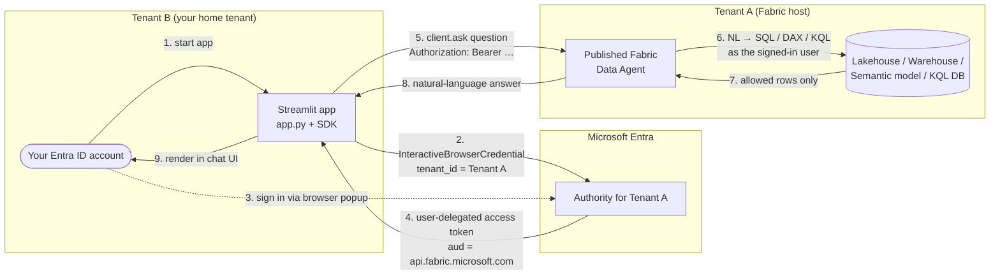

# Fabric Data Agent — Cross-Tenant Demo

Minimal Streamlit chat app that lets a user in **Tenant B** talk to a
**Microsoft Fabric Data Agent** published in **Tenant A**, using interactive
Microsoft Entra ID sign-in (no service principal, no orchestrator, no
middle-tier).

The implementation follows the official Microsoft Learn pattern:
**[Consume a Fabric data agent with the Python client SDK (preview)](https://learn.microsoft.com/fabric/data-science/consume-data-agent-python)**.

> **Preview notice.** Fabric Data Agent and its Python client SDK are in
> [Public Preview](https://learn.microsoft.com/fabric/fundamentals/preview).
> APIs, endpoints, and behavior may change without notice.

---

## What this repo contains

Everything lives in [demo/](demo/):

| File | Purpose |
|---|---|
| [demo/app.py](demo/app.py) | Streamlit chat UI (sign-in gate, sidebar, chat history, per-session thread). |
| [demo/fabric_data_agent_client.py](demo/fabric_data_agent_client.py) | Verbatim MIT-licensed copy of the official Microsoft client SDK from [microsoft/fabric_data_agent_client](https://github.com/microsoft/fabric_data_agent_client). One small local edit: `api_key="not-used"` instead of `api_key=""` so the modern OpenAI Python SDK constructor passes its validation (auth is still done via the `Authorization: Bearer …` header). |
| [demo/requirements.txt](demo/requirements.txt) | `streamlit`, `azure-identity`, `openai`, `requests`, `python-dotenv`. |
| [demo/.env.example](demo/.env.example) | Template for the two required values (`TENANT_ID`, `DATA_AGENT_URL`). |
| [demo/README.md](demo/README.md) | Step-by-step setup, run, and troubleshooting guide. |

There are **no other files** — the whole demo is ~5 files.

---

## How it works



1. The Streamlit app calls
   [`InteractiveBrowserCredential(tenant_id=<Tenant A>)`](https://learn.microsoft.com/python/api/azure-identity/azure.identity.interactivebrowsercredential)
   from `azure-identity` and opens the system browser.
2. The user picks an Entra ID account that can sign in to Tenant A — this can
   be a **guest** account whose home tenant is Tenant B
   ([Microsoft Entra B2B guest user](https://learn.microsoft.com/entra/external-id/what-is-b2b)).
3. Microsoft Entra issues an access token with the audience
   `https://api.fabric.microsoft.com/.default`.
4. The `FabricDataAgentClient.ask()` method uses that token (via the
   `Authorization: Bearer …` header) to call the Fabric Data Agent's
   Assistants-API endpoint: create assistant → create thread → post message →
   create run → poll until complete → fetch reply.
5. The data agent runs queries **as the signed-in user**, so it only returns
   rows the user is allowed to see (identity passthrough — see the
   [Fabric data agent concept](https://learn.microsoft.com/fabric/data-science/concept-data-agent)).

No app registration is needed for this scenario: `InteractiveBrowserCredential`
defaults to the well-known Azure CLI public client (`04b07795-…`), which is
already consented in most tenants for the Microsoft Fabric scope.

---

## Why this is "cross-tenant"

Microsoft Fabric Data Agents currently **do not support a Service Principal**
on the user-identity call path — they require an end-user token (see the
authentication notes in
[Consume a Fabric data agent with the Python client SDK](https://learn.microsoft.com/fabric/data-science/consume-data-agent-python)).
This demo solves the cross-tenant problem the simplest possible way:

- Skip server-to-server token exchange entirely.
- Sign the user in **directly to Tenant A** with their guest account.
- Pass the resulting user token straight to the Fabric Data Agent.

Result: a Tenant B user gets data from a Tenant A Fabric workspace through a
local Streamlit app, with no extra Azure infrastructure.

---

## Prerequisites

**In Tenant A (Fabric host):**

1. A paid **F2 (or higher) Fabric capacity**, or a **Power BI Premium P1+**
   capacity with [Microsoft Fabric enabled](https://learn.microsoft.com/fabric/admin/fabric-switch)
   ([feature parity list](https://learn.microsoft.com/fabric/enterprise/fabric-features)).
2. Tenant setting **"Cross-geo processing for AI"** and **"Cross-geo storing for AI"** enabled per
   [Fabric data agent tenant settings](https://learn.microsoft.com/fabric/data-science/data-agent-tenant-settings),
   if your capacity is in a different geo than your data.
3. A **published** Fabric Data Agent backed by at least one supported data
   source: Lakehouse, Warehouse, Power BI semantic model, KQL DB, mirrored DB,
   or ontology.

**In Tenant B (your home tenant):**

4. Your Entra ID account has been **invited as a guest** to Tenant A
   ([Microsoft Entra B2B](https://learn.microsoft.com/entra/external-id/b2b-quickstart-add-guest-users-portal))
   and the invitation is accepted.
5. That guest account has **read** access to the data source bound to the agent.

That's it. No app registration, no Key Vault, no Container Apps, no Foundry
project.

---

## Quickstart

```pwsh
cd c:\mycodes\fabric_cross_tenant\demo

# 1. Configure the two values
Copy-Item .env.example .env
notepad .env       # fill in TENANT_ID and DATA_AGENT_URL

# 2. Create venv + install deps
python -m venv .venv
.\.venv\Scripts\Activate.ps1
pip install -r requirements.txt

# 3. Run
streamlit run app.py
```

Open http://localhost:8501, sign in when the browser pops, then chat.

For the full walkthrough (where to find `DATA_AGENT_URL`, troubleshooting
table, sign-out / new-conversation buttons) see [demo/README.md](demo/README.md).

---

## Key Microsoft Learn references

- [Consume a Fabric data agent with the Python client SDK (preview)](https://learn.microsoft.com/fabric/data-science/consume-data-agent-python) — the pattern this demo implements.
- [Fabric data agent concept](https://learn.microsoft.com/fabric/data-science/concept-data-agent) — what a Fabric Data Agent is and how authentication works.
- [Fabric data agent tenant settings](https://learn.microsoft.com/fabric/data-science/data-agent-tenant-settings) — cross-geo and cross-tenant prerequisites.
- [`InteractiveBrowserCredential` API reference](https://learn.microsoft.com/python/api/azure-identity/azure.identity.interactivebrowsercredential) — the credential used for sign-in.
- [Microsoft Entra B2B collaboration overview](https://learn.microsoft.com/entra/external-id/what-is-b2b) — how a Tenant B user can sign in to Tenant A as a guest.
- [Microsoft Fabric preview features](https://learn.microsoft.com/fabric/fundamentals/preview) — preview terms.

---

## License

`demo/fabric_data_agent_client.py` is a verbatim copy of code from
[microsoft/fabric_data_agent_client](https://github.com/microsoft/fabric_data_agent_client),
published by Microsoft under the [MIT License](https://github.com/microsoft/fabric_data_agent_client/blob/main/LICENSE).
The remaining files in this repository are provided **as-is**, without
warranty of any kind. Microsoft product names (Microsoft Fabric, Power BI,
Microsoft Entra, Azure, etc.) are trademarks of Microsoft Corporation and are
used here for technical reference only.
