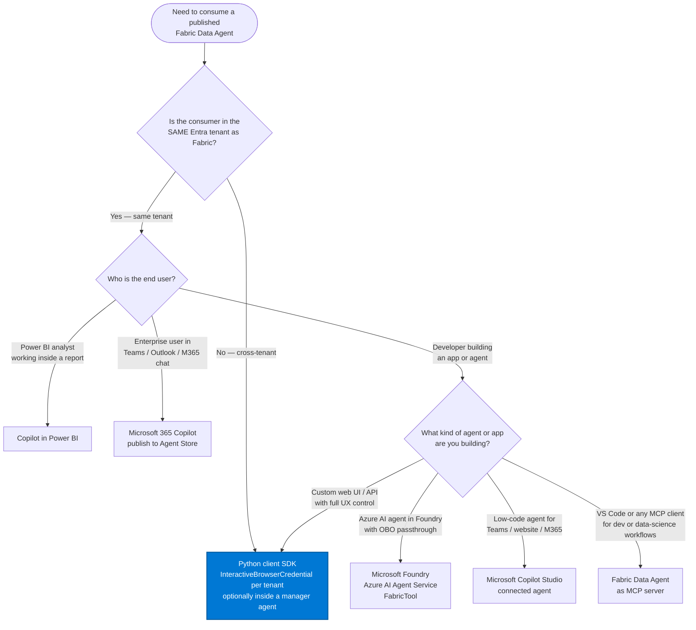
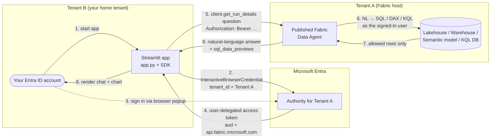
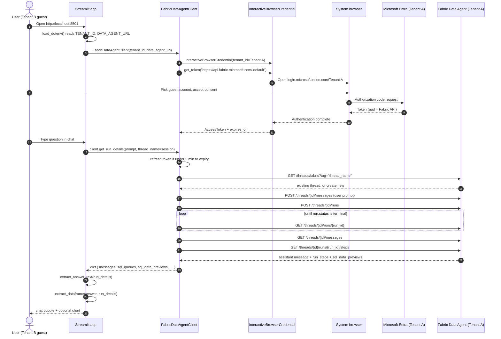
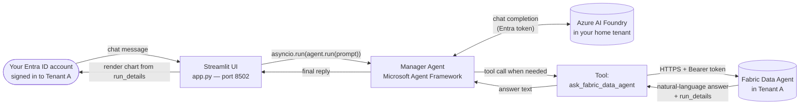
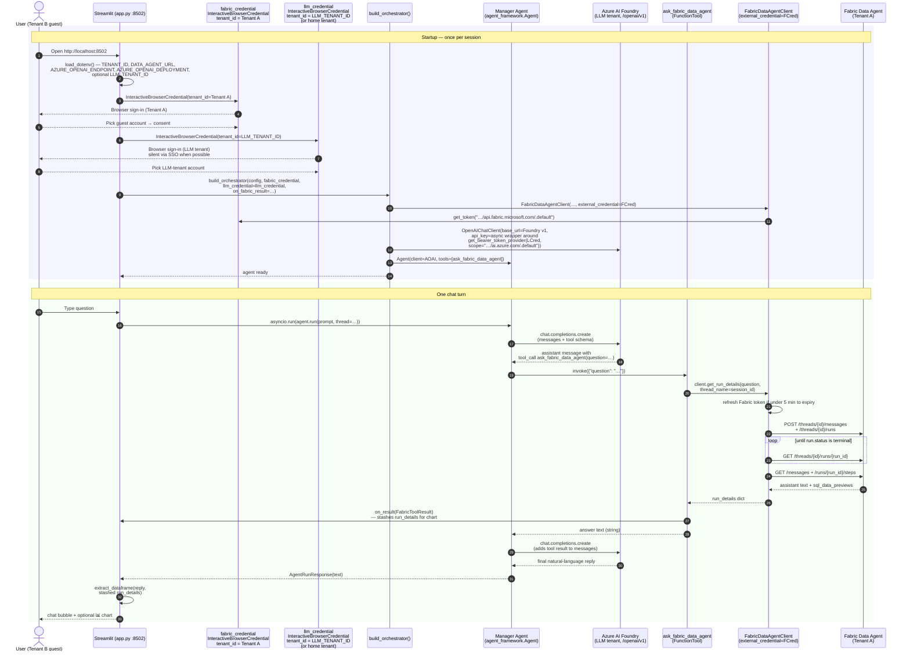

# Fabric Data Agent — Cross-Tenant Demos

**Language:** **English** · [Bahasa Indonesia](README.id.md)

This repository contains **two** progressively-richer Streamlit demos for the
same cross-tenant scenario: a user in **Tenant B** consuming a **Microsoft
Fabric Data Agent** published in **Tenant A**, using interactive Microsoft
Entra ID sign-in (no service principal, no middle-tier).

The implementation follows the official Microsoft Learn pattern:
**[Consume a Fabric data agent with the Python client SDK (preview)](https://learn.microsoft.com/fabric/data-science/consume-data-agent-python)**.

> **Preview notice.** Microsoft Fabric Data Agent, its Python client SDK,
> and Microsoft Agent Framework are all in
> [Public Preview](https://learn.microsoft.com/fabric/fundamentals/preview).
> APIs, endpoints, and behavior may change without notice.

> **Status.** Both demos are verified end-to-end. The orchestrator demo
> has been validated in a true cross-tenant configuration (Fabric in
> Tenant A, Azure AI Foundry in a separate tenant) using two
> `InteractiveBrowserCredential` instances and the optional
> `LLM_TENANT_ID` env var — see [Configuration reference](#configuration-reference-env-values).

---

## Table of contents

- [Pick your demo](#pick-your-demo)
- [Ways to consume a Fabric Data Agent](#ways-to-consume-a-fabric-data-agent)
  - [The six official consumption patterns](#the-six-official-consumption-patterns)
  - [Decision tree — which pattern should I use?](#decision-tree--which-pattern-should-i-use)
  - [Where these demos fit](#where-these-demos-fit)
- [Repository layout](#repository-layout)
- [Architecture](#architecture)
  - [Shared cross-tenant identity model](#shared-cross-tenant-identity-model)
  - [Detailed sequence — auth + one chat turn (simple demo)](#detailed-sequence--auth--one-chat-turn-simple-demo)
  - [Manager-agent architecture (orchestrator demo)](#manager-agent-architecture-orchestrator-demo)
  - [Detailed sequence — orchestrator chat turn](#detailed-sequence--orchestrator-chat-turn)
- [Why this is "cross-tenant"](#why-this-is-cross-tenant)
- [Prerequisites](#prerequisites)
- [Quickstart](#quickstart)
  - [Simple demo (`demo/`, port 8501)](#simple-demo-demo-port-8501)
  - [Orchestrator demo (`demo-orchestrator/`, port 8502)](#orchestrator-demo-demo-orchestrator-port-8502)
- [Configuration reference (`.env` values)](#configuration-reference-env-values)
- [Tests](#tests)
- [Chart rendering](#chart-rendering)
- [Vendored SDK note](#vendored-sdk-note)
- [Extending the orchestrator](#extending-the-orchestrator)
- [Troubleshooting](#troubleshooting)
- [Microsoft Learn references](#microsoft-learn-references)
- [License](#license)

---

## Pick your demo

| Folder | What it shows | Start here when… |
|---|---|---|
| [demo/](demo/) | **Direct** call to the Fabric Data Agent (no LLM in the middle). ~6 files. | You want the smallest possible reference of the Fabric Data Agent Python SDK + the cross-tenant sign-in pattern. |
| [demo-orchestrator/](demo-orchestrator/) | A **Microsoft Agent Framework "manager" agent** with the Fabric Data Agent registered as one tool. Azure AI Foundry handles tool planning. **Two Entra credentials** are used — one for Fabric in Tenant A, one for the Foundry tenant — so this works even when Fabric and Foundry live in different tenants. Includes a 16-test pytest suite. | You want the recommended manager-agent pattern from Microsoft Agent Framework, ready to extend with more tools (Foundry agent, Bing, custom Python, …). |

Both demos can run side-by-side: the simple demo defaults to port **8501**,
the orchestrator demo to port **8502**.

---

## Ways to consume a Fabric Data Agent

Microsoft Learn currently documents **six** officially supported ways to
consume a published Fabric Data Agent. The two demos in this repo are
focused on the **Python client SDK** pattern (extended for cross-tenant
and wrapped in a Microsoft Agent Framework manager agent), but the right
choice depends on **who** is asking the questions and **where** they
live. This section summarizes the trade-offs so you can pick the right
pattern for *your* scenario.

### The six official consumption patterns

| # | Pattern | Best for | Tenant model | Key constraint |
|---|---|---|---|---|
| 1 | **[Microsoft Foundry — Azure AI Agent Service](https://learn.microsoft.com/fabric/data-science/data-agent-foundry)** | Building an Azure AI agent in Foundry that uses Fabric as a knowledge tool (`FabricTool`). Identity-passthrough (OBO) is built in. | **Same tenant only** — Fabric and Foundry must share the tenant and the signed-in account. | Only **one** Fabric Data Agent can be attached as a knowledge source per Azure AI agent. Requires `AI Developer` RBAC role in Foundry. |
| 2 | **[Copilot in Power BI](https://learn.microsoft.com/fabric/data-science/data-agent-copilot-powerbi)** | Power BI analysts asking ad-hoc questions inside a report or from the standalone Copilot pane. Zero code. | Same tenant. | Discovery-only experience — Copilot ranks the agent against semantic models and reports; you can also attach a specific Data Agent manually. |
| 3 | **[Microsoft Copilot Studio](https://learn.microsoft.com/fabric/data-science/data-agent-microsoft-copilot-studio)** | Low-code makers building a custom AI agent to deploy on Teams, websites, or Microsoft 365 Copilot — adds Fabric as a **connected agent**. | Same tenant; requires generative orchestration **on**. | Requires Microsoft 365 Copilot license + per-user license. Auth can be **User** or **Agent author**. |
| 4 | **[Python client SDK](https://learn.microsoft.com/fabric/data-science/consume-data-agent-python)** *(this repo's pattern)* | Custom web apps, Streamlit/Flask UIs, scripts, or wrapping the Data Agent as a tool inside a Microsoft Agent Framework / Semantic Kernel agent. **Full UX control.** | Works **same-tenant** *and* **cross-tenant** (use a tenant-scoped `InteractiveBrowserCredential` per resource — see [demo-orchestrator/orchestrator.py](demo-orchestrator/orchestrator.py)). | User identity only — Service Principal Name (SPN) auth for the Data Agent endpoint itself is in preview and not covered by the SDK sample. |
| 5 | **[Microsoft 365 Copilot](https://learn.microsoft.com/fabric/data-science/data-agent-microsoft-365-copilot)** | Enterprise end-users in Teams / Outlook / the Copilot chat — publish the Data Agent to the **Agent Store** and let users `@mention` it. | Same tenant. | Requires Microsoft 365 Copilot license; M365 Copilot's own orchestrator will reason over / reshape the answer (configurable via the publishing description). |
| 6 | **[Fabric Data Agent as MCP server](https://learn.microsoft.com/fabric/data-science/data-agent-mcp-server)** | Developers and data scientists working in **VS Code** (GitHub Copilot Agent Mode) or any Model Context Protocol client. Plug it in via `mcp.json`. | Tenant-agnostic from the client side, but the user must sign in to the tenant that hosts the Data Agent. | Currently officially supported in **VS Code**; the agent is exposed as a single MCP tool — the **publishing description becomes the tool description**, so write it carefully. |

### Decision tree — which pattern should I use?

The quickest way to land on the right pattern is to answer two questions:
**(1) is the consumer in the same Entra tenant as Fabric?** and
**(2) who is the end user?**



> The blue node is the pattern implemented by this repository.

### Where these demos fit

Both demos in this repo implement **pattern #4 — the Python client SDK**,
but they cover two different sub-scenarios on the decision tree:

- **[demo/](demo/)** is the *minimal* SDK reference. One credential, one
  tenant, no LLM in the middle — useful when you want to verify the
  cross-tenant sign-in path or embed the Data Agent answer directly into
  your own UI.
- **[demo-orchestrator/](demo-orchestrator/)** extends pattern #4 with a
  **Microsoft Agent Framework manager agent** that uses **two**
  `InteractiveBrowserCredential` instances — one for Fabric in Tenant A,
  one for Azure AI Foundry in the home (or `LLM_TENANT_ID`) tenant. This
  is the pattern to copy when Fabric and your LLM live in **different**
  Entra tenants, which the other five patterns currently don't support.

If your scenario matches a different leaf of the decision tree (Foundry
same-tenant, Power BI, Copilot Studio, M365 Copilot, or MCP), follow the
Microsoft Learn link in the table above — those flows are fully UI-driven
and don't need the code in this repo.

---

## Repository layout

### `demo/` — single-agent reference

| File | Purpose |
|---|---|
| [demo/app.py](demo/app.py) | Streamlit chat UI (sign-in gate, sidebar, chat history, per-session thread, **chart rendering**). |
| [demo/chart_utils.py](demo/chart_utils.py) | Client-side helpers: extract answer text + a `pandas` DataFrame from the agent's response and render with Streamlit's native charts. See [Chart rendering](#chart-rendering). |
| [demo/fabric_data_agent_client.py](demo/fabric_data_agent_client.py) | Verbatim MIT-licensed copy of [microsoft/fabric_data_agent_client](https://github.com/microsoft/fabric_data_agent_client), with one tiny local edit (`api_key="not-used"`). See [Vendored SDK note](#vendored-sdk-note). |
| [demo/requirements.txt](demo/requirements.txt) | `streamlit`, `azure-identity`, `openai`, `requests`, `python-dotenv`, `pandas`. |
| [demo/.env.example](demo/.env.example) | Template for the two required values (`TENANT_ID`, `DATA_AGENT_URL`). |

### `demo-orchestrator/` — manager agent with one tool

| File | Purpose |
|---|---|
| [demo-orchestrator/orchestrator.py](demo-orchestrator/orchestrator.py) | Factory that builds a single `agent_framework.Agent` whose only tool today is `ask_fabric_data_agent`. Designed to be extended with more tools later — see [Extending the orchestrator](#extending-the-orchestrator). |
| [demo-orchestrator/app.py](demo-orchestrator/app.py) | Streamlit chat UI on port **8502** — routes every chat turn through the manager agent. |
| [demo-orchestrator/chart_utils.py](demo-orchestrator/chart_utils.py) | Vendored verbatim from `demo/`. |
| [demo-orchestrator/fabric_data_agent_client.py](demo-orchestrator/fabric_data_agent_client.py) | Vendored from `demo/` with one tiny additional edit: `__init__` accepts `external_credential=` so the Streamlit layer can share its Fabric credential with the SDK instead of forcing a second sign-in. |
| [demo-orchestrator/tests/](demo-orchestrator/tests/) | Pytest unit tests (16/16 pass, no network). See [Tests](#tests). |
| [demo-orchestrator/pytest.ini](demo-orchestrator/pytest.ini) | Adds `pythonpath = .` so tests can `import orchestrator` from any cwd. |
| [demo-orchestrator/requirements.txt](demo-orchestrator/requirements.txt) | Adds `agent-framework`, `pytest`, `pytest-asyncio` on top of the simple demo's deps. |
| [demo-orchestrator/.env.example](demo-orchestrator/.env.example) | Template for the env vars (`TENANT_ID`, `DATA_AGENT_URL`, `AZURE_OPENAI_ENDPOINT`, `AZURE_OPENAI_DEPLOYMENT`, optional `LLM_TENANT_ID`). |

---

## Architecture

### Shared cross-tenant identity model

Both demos let a Tenant B user reach a Fabric Data Agent in Tenant A
without a service principal or middle-tier:

- The **simple demo** uses **one** interactive sign-in (against Tenant A)
  and passes that token straight to the Fabric Data Agent.
- The **orchestrator demo** adds an Azure AI Foundry LLM. Because Fabric
  and Foundry typically live in **different** Entra tenants, the demo
  uses **two** `InteractiveBrowserCredential` instances — one bound to
  Tenant A (for Fabric), one bound to the Foundry tenant (for the LLM).
  When both resources happen to live in the same tenant, the second
  sign-in completes silently via SSO; when they don't, the user signs in
  twice (typically once interactive, once silent via Edge SSO).



1. The Streamlit app calls
   [`InteractiveBrowserCredential(tenant_id=<Tenant A>)`](https://learn.microsoft.com/python/api/azure-identity/azure.identity.interactivebrowsercredential)
   from `azure-identity` and opens the system browser.
2. The user picks an Entra ID account that can sign in to Tenant A — this
   can be a **guest** account whose home tenant is Tenant B
   ([Microsoft Entra B2B guest user](https://learn.microsoft.com/entra/external-id/what-is-b2b)).
3. Microsoft Entra issues an access token with the audience
   `https://api.fabric.microsoft.com/.default`.
4. The `FabricDataAgentClient` uses that token (via the
   `Authorization: Bearer …` header) to call the Fabric Data Agent's
   Assistants-API endpoint: create assistant → create thread → post message →
   create run → poll until complete → fetch reply.
5. The data agent runs queries **as the signed-in user**, so it only returns
   rows the user is allowed to see (identity passthrough — see the
   [Fabric data agent concept](https://learn.microsoft.com/fabric/data-science/concept-data-agent)).

No app registration is needed: `InteractiveBrowserCredential` defaults to
the well-known Azure CLI public client (`04b07795-…`), which is already
consented in most tenants for the Microsoft Fabric scope.

### Detailed sequence — auth + one chat turn (simple demo)



### Manager-agent architecture (orchestrator demo)

The orchestrator demo adds one layer: the user no longer talks to the Fabric
Data Agent directly. They talk to a **manager agent** (Microsoft Agent
Framework `Agent`) that decides per-turn whether to call the Fabric Data
Agent — exposed to the LLM as a tool named `ask_fabric_data_agent`.



Key properties of the orchestrator demo:

- **Two credentials, two tenants.** Fabric and Azure AI Foundry usually
  live in different Entra tenants, and a single user-delegated token is
  only valid for one tenant at a time. The demo therefore creates two
  `InteractiveBrowserCredential` instances:
  - `fabric_credential = InteractiveBrowserCredential(tenant_id=<Tenant A>)`
    — requests the Fabric scope `https://api.fabric.microsoft.com/.default`.
  - `llm_credential = InteractiveBrowserCredential(tenant_id=<LLM_TENANT_ID>)`
    (or no `tenant_id` to use the home tenant) — requests the Foundry
    scope `https://ai.azure.com/.default`.

  When both resources are in the same tenant, the second sign-in is
  silent via Edge SSO; in true cross-tenant setups the user picks the
  matching account on each prompt.
- **The manager LLM is Azure AI Foundry in *its* tenant.** Only the
  Fabric tool reaches across into Tenant A. Prompts and tool-call
  planning never leave the Foundry tenant.
- **`run_details` short-circuits the chart path.** The Fabric tool's
  `on_result` callback hands the raw `run_details` dict to the Streamlit
  layer, which calls `chart_utils.extract_dataframe(...)` — the same way
  the simple [demo/app.py](demo/app.py) does. No second round-trip.
- **The manager pattern keeps the agent code small.** A single
  `Agent(client=…, tools=[fabric_tool])` is the whole orchestrator — see
  [`build_orchestrator`](demo-orchestrator/orchestrator.py).

### Detailed sequence — orchestrator chat turn

This is the orchestrator counterpart of the simple-demo sequence diagram
above. It shows the full end-to-end path of **one chat turn** through the
manager agent — from Streamlit, through Microsoft Agent Framework's LLM
tool-planning, into the Fabric Data Agent, and back to the chart-rendering
UI. **Two `InteractiveBrowserCredential` instances** are used: one bound
to Tenant A for Fabric, one bound to the Foundry tenant
(`LLM_TENANT_ID`, or the home tenant when unset) for Azure AI Foundry's
`/openai/v1` endpoint.



Notes on the flow:

- **Startup happens once per session.** Subsequent chat turns reuse the
  same `Agent`, `FabricDataAgentClient`, and both credentials — each
  credential caches and auto-refreshes its own token.
- **Two credentials, two scopes.** `fabric_credential` (Tenant A) requests
  `https://api.fabric.microsoft.com/.default`. `llm_credential`
  (`LLM_TENANT_ID`, or the home tenant when unset) requests
  `https://ai.azure.com/.default`. Foundry requires a token whose `tid`
  claim matches the resource's tenant; a single Tenant A token would be
  rejected with `Tenant provided in token does not match resource token`.
- **Async API-key provider.** The OpenAI v1 client's
  `AsyncOpenAI._refresh_api_key` always awaits its `api_key` callable, so
  the orchestrator wraps `azure.identity.get_bearer_token_provider`
  (which is synchronous) in an `async def` before passing it as
  `api_key=`. Without this wrapper, the first Foundry call fails with
  `object str can't be used in 'await' expression`.
- **The LLM is called twice per turn** (steps 16 and 28): once to *plan*
  the tool call, once to *summarize* the tool's answer. If the LLM
  decides no tool is needed it returns the final reply on the first call
  and the Fabric round-trip is skipped entirely.
- **`on_result` runs inside the tool** (step 24), *before* the answer
  goes back to the LLM. That is what makes chart rendering possible —
  the raw `run_details` (with `sql_data_previews`) is captured for the
  Streamlit layer even though the LLM only sees the text summary.
- **`thread_name=session_id`** keeps each browser session on its own
  Fabric thread, so multi-turn questions retain context server-side.

---

## Why this is "cross-tenant"

Microsoft Fabric Data Agents support **two** identity types on the call
path (both in preview):

1. The **end user** signed in with Microsoft Entra ID — see
   [Consume a Fabric data agent with the Python client SDK](https://learn.microsoft.com/fabric/data-science/consume-data-agent-python).
2. A **service principal** — see
   [Use service principal authentication with Fabric data agent](https://learn.microsoft.com/fabric/data-science/data-agent-service-principal)
   (added in May 2026; **not yet supported** for data agents backed by a
   KQL database).

These demos intentionally use option **(1)** for the cross-tenant case
because:

- The Tenant A data agent and its data sources enforce permissions per the
  *calling* Microsoft Entra identity. Using each user's own token preserves
  row-level security, sensitivity labels, and audit trails *as that user*
  in Tenant A.
- A service principal would be a single shared, non-interactive identity —
  not the actual end user. It also requires the Tenant A admin to register
  an app (or accept a multi-tenant one), enable **"Service principals can
  use Fabric APIs"**, and grant it Member / Contributor on the workspace
  plus read on every data source. That is the right pattern for
  *automation*, not for "a Tenant B human asks a question".
- Skipping server-to-server token exchange means no app registration, no
  secret management, and no middle-tier in Tenant B at all.

How it works in these demos:

- Skip server-to-server token exchange entirely.
- Sign the user in **directly to Tenant A** with their guest account, and
  (in the orchestrator demo) **also into the Foundry tenant** with a
  second `InteractiveBrowserCredential` bound to `LLM_TENANT_ID`.
- Pass the resulting per-tenant user tokens straight to the Fabric Data
  Agent and (in the orchestrator demo) to Azure AI Foundry's v1 OpenAI
  endpoint.

---

## Prerequisites

### Common — Tenant A (Fabric host)

1. A paid **F2 (or higher) Fabric capacity**, or a **Power BI Premium P1+**
   capacity with [Microsoft Fabric enabled](https://learn.microsoft.com/fabric/admin/fabric-switch)
   ([feature parity list](https://learn.microsoft.com/fabric/enterprise/fabric-features)).
2. Tenant settings **"Cross-geo processing for AI"** and **"Cross-geo
   storing for AI"** enabled per
   [Fabric data agent tenant settings](https://learn.microsoft.com/fabric/data-science/data-agent-tenant-settings),
   if your capacity is in a different geo than your data.
3. A **published** Fabric Data Agent backed by at least one supported data
   source: Lakehouse, Warehouse, Power BI semantic model, KQL DB, mirrored
   DB, or ontology.

### Common — Tenant B (your home tenant)

4. Your Microsoft Entra ID account has been **invited as a guest** to
   Tenant A
   ([Microsoft Entra B2B quickstart](https://learn.microsoft.com/entra/external-id/b2b-quickstart-add-guest-users-portal))
   and the invitation has been accepted.
5. That guest account has **read** access to the data source bound to the
   Fabric Data Agent.

### On your laptop

6. Python **3.11+** (3.9+ works for the simple demo; 3.11+ recommended for
   both).
7. A default web browser that can open `login.microsoftonline.com`.

### Only for the orchestrator demo

8. An **Azure AI Foundry resource** (an Azure AI Services account, host
   name `*.services.ai.azure.com`) with a chat-model deployment
   (`gpt-5.4-mini`, `gpt-4o-mini`, `gpt-4.1`, etc.). The orchestrator
   uses the **v1 OpenAI endpoint** of that resource — the URL must end
   with `/openai/v1`.
9. Your Entra ID account has a role on that Foundry resource that lets
   you call model deployments (e.g. **Azure AI User**, **Cognitive
   Services User**, or higher). See
   [Azure AI services RBAC](https://learn.microsoft.com/azure/ai-services/role-based-access-control).

That's it. No app registration, no Key Vault, no Container Apps, no
Foundry project.

---

## Quickstart

### Simple demo (`demo/`, port 8501)

```pwsh
cd c:\mycodes\fabric_cross_tenant\demo

# 1. Configure the two values
Copy-Item .env.example .env
notepad .env       # fill in TENANT_ID and DATA_AGENT_URL

# 2. Create venv + install deps
python -m venv .venv
.\.venv\Scripts\Activate.ps1
pip install -r requirements.txt

# 3. Run
streamlit run app.py
```

Open <http://localhost:8501>, sign in when the browser pops, then chat.

**Sidebar controls** (both demos):

- **🆕 New conversation** — generates a new thread name and clears chat
  history (starts a fresh agent thread on the next message).
- **🚪 Sign out** — drops the cached credential(s). The next message
  re-opens the browser sign-in (both sign-ins in the orchestrator demo).

### Orchestrator demo (`demo-orchestrator/`, port 8502)

```pwsh
cd c:\mycodes\fabric_cross_tenant\demo-orchestrator

# 1. Configure (4 required + 1 optional var: Tenant A + Azure AI Foundry + LLM_TENANT_ID)
Copy-Item .env.example .env
notepad .env

# 2. Create venv + install deps
python -m venv .venv
.\.venv\Scripts\Activate.ps1
pip install -r requirements.txt

# 3. Run tests (no network)
python -m pytest tests -v

# 4. Run on port 8502 so both demos can coexist
python -m streamlit run app.py --server.port=8502
```

Open <http://localhost:8502>, sign in when the Entra browser pops, then
chat.

> **Note.** If `streamlit.exe` was not generated in `.venv\Scripts\` by
> your pip install, use `python -m streamlit run app.py …` as shown above.

---

## Configuration reference (`.env` values)

### `demo/.env`

```ini
# Tenant ID of Tenant A (where the Fabric workspace lives)
# Azure portal → Microsoft Entra ID → Overview → Tenant ID
TENANT_ID=00000000-0000-0000-0000-000000000000

# Published URL of the Fabric Data Agent (Assistants-API style)
# Fabric → published Data Agent → Settings → "Published endpoint" → OpenAI URL
DATA_AGENT_URL=https://api.fabric.microsoft.com/v1/workspaces/<workspace-id>/dataagents/<agent-id>/aiassistant/openai
```

### `demo-orchestrator/.env`

```ini
# Tenant A (same as the simple demo)
TENANT_ID=00000000-0000-0000-0000-000000000000
DATA_AGENT_URL=https://api.fabric.microsoft.com/v1/workspaces/<workspace-id>/dataagents/<agent-id>/aiassistant/openai

# Azure AI Foundry v1 OpenAI endpoint (must end with /openai/v1)
AZURE_OPENAI_ENDPOINT=https://<your-foundry-resource>.services.ai.azure.com/openai/v1
AZURE_OPENAI_DEPLOYMENT=gpt-5.4-mini

# Optional — tenant the Foundry resource lives in. Set this when Foundry
# is in a DIFFERENT tenant from TENANT_ID (the true cross-tenant case).
# Leave empty to let MSAL pick the user's home tenant.
LLM_TENANT_ID=
```

`AZURE_OPENAI_DEPLOYMENT` is the **deployment name** (what you named it in
Azure AI Foundry), *not* the underlying model name.

### Where to find the values

- **`TENANT_ID`** — Azure portal → **Microsoft Entra ID** → **Overview** →
  **Tenant ID**. Format: GUID.
- **`DATA_AGENT_URL`** — Fabric portal → open your **published Data
  Agent** → **Settings** → **Published endpoint** → copy the OpenAI URL.
- **`AZURE_OPENAI_ENDPOINT`** — Azure AI Foundry → your project →
  **Overview** → **Endpoints** → the **Azure AI Foundry** entry. Take the
  base URL and append `/openai/v1` (e.g.
  `https://foundry-zeroquery-poc.services.ai.azure.com/openai/v1`).
- **`AZURE_OPENAI_DEPLOYMENT`** — Azure AI Foundry → your project →
  **Deployments** → the **deployment name** column.
- **`LLM_TENANT_ID`** *(optional)* — only set this when the Foundry
  resource lives in a **different** Entra tenant from `TENANT_ID`.
  Azure portal → the Foundry / Azure AI Services resource → **Overview**
  → **Directory ID** (or **Microsoft Entra ID** → **Overview** →
  **Tenant ID** in the directory that owns the resource). Leave empty
  when Foundry is in your home tenant or in the same tenant as Fabric.

---

## Tests

Comprehensive unit tests live in [demo-orchestrator/tests/](demo-orchestrator/tests/).
They mock the Foundry chat client and the `FabricDataAgentClient` — no
real network calls are made.

```pwsh
cd c:\mycodes\fabric_cross_tenant\demo-orchestrator
.\.venv\Scripts\python.exe -m pytest tests -v
```

Expected output: **16 passed**.

What's covered:

- **[tests/test_tools.py](demo-orchestrator/tests/test_tools.py)** — the
  Fabric tool wrapper
  - Correct `name`, `description`, and JSON schema (`question: string`,
    required).
  - Returns the assistant text extracted from `run_details`.
  - Uses the supplied `thread_name`.
  - Fires the `on_result` callback with a `FabricToolResult` instance.
  - Callback exceptions are swallowed (a broken UI must never break the
    tool).
  - Empty / blank input → friendly error, no client call.
  - Error dict from the client → surfaced verbatim.
  - Empty assistant messages → `"(no answer returned)"` fallback.
  - End-to-end async invocation via `FunctionTool.invoke(...)` — exercises
    the framework's argument-parsing path.
- **[tests/test_orchestrator.py](demo-orchestrator/tests/test_orchestrator.py)** —
  config + factory
  - `OrchestratorConfig.from_env`: happy path, default API version,
    missing-var detection (lists only the *missing* ones), whitespace-only
    treated as missing.
  - `build_orchestrator`: returns a real `Agent`, registers the Fabric
    tool, respects custom instructions, and accepts `extra_tools` so you
    can append more tools without touching the factory.

---

## Chart rendering

The Fabric Data Agent **does not generate chart images itself**. Per
[Fabric data agent concepts](https://learn.microsoft.com/fabric/data-science/concept-data-agent),
the agent uses Azure OpenAI Assistants APIs to translate natural language
into **SQL / DAX / KQL / Microsoft Graph** queries, executes those queries
with the caller's identity (read-only), and returns a structured,
human-readable answer. Image generation (a.k.a. *Code Interpreter*) is
**only** available in adjacent surfaces —
[Microsoft Foundry agents](https://learn.microsoft.com/azure/foundry/agents/how-to/tools/code-interpreter),
[Copilot Studio prompts](https://learn.microsoft.com/microsoft-copilot-studio/code-interpreter-prompts-examples),
[Microsoft 365 Copilot extensibility](https://learn.microsoft.com/microsoft-365/copilot/extensibility/code-interpreter)
— not in the Fabric Data Agent.

**Both demos therefore render charts on the client** from whichever
tabular shape the agent gives us. Each turn calls
[`client.get_run_details(prompt, thread_name=…)`](demo/fabric_data_agent_client.py)
once (single round-trip) and the dict it returns contains, per the
[MS Learn SDK reference](https://learn.microsoft.com/fabric/data-science/consume-data-agent-python#ask-the-data-agent-a-question):

- `messages` — full Assistants-API message list. We pull the latest
  assistant text via `extract_answer_text()`.
- `sql_queries` — every SQL/DAX/KQL the agent ran.
- `sql_data_previews` — a markdown-formatted preview of each query's rows.

`extract_dataframe()` then tries, in order:

1. Parse the first GitHub-flavored markdown table inside the assistant's
   text answer (the most common shape for tabular Lakehouse / Warehouse /
   KQL questions — the LLM already renders one inline).
2. Fall back to `sql_data_previews` and parse the first markdown table
   there.

If a `pandas.DataFrame` is obtained, the chat bubble shows a **📊 Chart**
expander with a chart-type picker (Auto, Bar, Line, Area, Scatter, Table
only). `infer_chart_type()` picks a sensible default:

- ≥1 categorical + ≥1 numeric column → **Bar**
- only numeric columns, ≥2 → **Scatter**
- otherwise → **Table only**

Rendering uses Streamlit's built-in charts
([`st.bar_chart` / `line_chart` / `area_chart` / `scatter_chart`](https://docs.streamlit.io/develop/api-reference/charts))
with `x` / `y` chosen from the inferred numeric / non-numeric columns. No
extra plotting library is required.

**Try it.** A prompt like:

> *"Show the top 5 products by revenue last quarter as a markdown table."*

reliably triggers an inline table and therefore an auto-rendered bar
chart.

### Chart rendering — limitations

- If the agent's answer contains no markdown table **and** no
  `sql_data_previews` (e.g. a single-number answer, a free-form summary,
  or a Power BI semantic-model answer that didn't produce a preview), no
  chart expander is shown.
- Numeric coercion strips `,`, `$`, `€`, `%`. Other formats (e.g.
  `K` / `M` suffixes, ISO dates as the X axis) currently render as
  strings.
- Data is parsed from the agent's own preview text. For very wide / very
  long query results the agent may truncate; in that case the chart
  reflects the truncated preview, not the full underlying result set.

---

## Vendored SDK note

Both demos vendor `fabric_data_agent_client.py` from
[microsoft/fabric_data_agent_client](https://github.com/microsoft/fabric_data_agent_client)
(MIT-licensed, single Python file).

**`demo/fabric_data_agent_client.py`** has **one** local edit:

```python
return OpenAI(
    api_key="not-used",   # was: api_key=""
    base_url=self.data_agent_url,
    …
    default_headers={"Authorization": f"Bearer {self.token.token}", …},
)
```

Recent versions of the [`openai` Python SDK](https://github.com/openai/openai-python)
(v2.x) raise `Missing credentials. Please pass an api_key, …` when the
constructor receives an empty string. Auth is still done **only** via the
`Authorization: Bearer …` header containing the Microsoft Entra access
token; the `api_key` value is never sent to Fabric.

**`demo-orchestrator/fabric_data_agent_client.py`** has the same edit
**plus** one extra constructor parameter so the orchestrator can hand the
SDK its already-built Fabric credential (avoiding a second sign-in inside
the SDK):

```python
def __init__(self, tenant_id, data_agent_url, *, external_credential=None):
    …
    if external_credential is not None:
        self.credential = external_credential
        self._refresh_token()
    else:
        self._authenticate()   # original behavior — opens a browser
```

When upstream releases a new version of the sample, pull it in and
re-apply these one-line changes.

---

## Extending the orchestrator

Adding a second tool is exactly two lines. Example — a hypothetical
web-search tool:

```python
from agent_framework import tool
from orchestrator import build_orchestrator, OrchestratorConfig

@tool(name="web_search", description="Search the public web for a phrase.")
def web_search(query: str) -> str:
    ...

agent = build_orchestrator(
    OrchestratorConfig.from_env(),
    fabric_credential,
    llm_credential=llm_credential,   # omit when Foundry shares the Fabric tenant
    extra_tools=[web_search],
)
```

Or wrap **another agent** as a tool (the "agent-as-tool" pattern from the
Agent Framework docs):

```python
from agent_framework import Agent
from agent_framework.openai import OpenAIChatClient

foundry_agent = Agent(
    client=OpenAIChatClient(...),
    name="ResearchAgent",
    instructions="You are a research assistant…",
)
agent = build_orchestrator(
    OrchestratorConfig.from_env(),
    fabric_credential,
    llm_credential=llm_credential,
    extra_tools=[foundry_agent.as_tool(
        name="ask_research_agent",
        description="Delegate deep research questions to the research agent.",
        arg_name="task",
    )],
)
```

See:

- [Microsoft Agent Framework — Agent with tools](https://learn.microsoft.com/agent-framework/user-guide/agents/agent-with-tools)
- [Microsoft Agent Framework — Multi-agent workflows](https://learn.microsoft.com/agent-framework/user-guide/workflows/overview)
- [`Agent.as_tool`](https://learn.microsoft.com/python/api/agent-framework/agent_framework.agent.agent#agent-framework-agent-agent-as-tool) — wrap one agent as a tool for another.

---

## Troubleshooting

| Symptom | Likely cause / fix |
|---|---|
| `Missing required environment variable(s): …` on startup | `.env` not present, in the wrong folder, or one of the values is blank. Confirm `.env` lives next to `app.py`. |
| Spinner stuck at **"🔐 Opening browser for Tenant A sign-in (Fabric)…"** or **"… home-tenant sign-in (Foundry)…"** | Default browser didn't open, or popup was blocked. Look in your taskbar for a new browser tab to `login.microsoftonline.com`. The orchestrator demo opens **two** sign-ins on first launch (one per tenant); the second often completes silently via Edge SSO. |
| `AADSTS50020` (user not authorized in tenant) | Your Tenant B account isn't a guest in Tenant A, or you haven't accepted the B2B invitation yet. See [Microsoft Entra B2B](https://learn.microsoft.com/entra/external-id/b2b-quickstart-add-guest-users-portal). |
| `AADSTS65001` (consent required) | First-time sign-in — accept the consent. If admin consent is required for the well-known Azure CLI app in Tenant A, ask the Tenant A admin to consent. |
| `Missing credentials. Please pass an api_key, …` | The [Vendored SDK note](#vendored-sdk-note) edit was lost. Restore `api_key="not-used"`. |
| `Tenant provided in token does not match resource token` (orchestrator only) | Foundry and Fabric are in **different** tenants and `LLM_TENANT_ID` is unset (or wrong). Set `LLM_TENANT_ID` in `demo-orchestrator/.env` to the tenant that owns the Foundry resource and restart Streamlit. |
| `object str can't be used in 'await' expression` (orchestrator only) | You've reverted the async wrapper around `get_bearer_token_provider` in [demo-orchestrator/orchestrator.py](demo-orchestrator/orchestrator.py). The OpenAI v1 client awaits its `api_key` callable, so it must be `async def`. |
| `(401) Authorization failed` from Azure AI Foundry (orchestrator only) | The signed-in user doesn't have a role that grants chat-completion access on the Foundry resource (e.g. **Azure AI User** / **Cognitive Services User**). See [Azure AI services RBAC](https://learn.microsoft.com/azure/ai-services/role-based-access-control). |
| `404 DeploymentNotFound` from Azure AI Foundry (orchestrator only) | `AZURE_OPENAI_DEPLOYMENT` doesn't match a deployment on your Foundry resource, or `AZURE_OPENAI_ENDPOINT` doesn't end with `/openai/v1`. Check Azure AI Foundry → Deployments. |
| `HTTP 403` from the Fabric Data Agent | Your guest account doesn't have **read** access to the data source bound to the Fabric Data Agent, or isn't on the workspace. |
| `HTTP 404` on `…/threads/fabric` | Wrong `DATA_AGENT_URL`. It must end with `/aiassistant/openai`. Re-copy from Fabric → Data Agent → Published endpoint. |
| Browser doesn't open at all | You're running Streamlit on a remote/headless host. Swap `InteractiveBrowserCredential` for [`DeviceCodeCredential`](https://learn.microsoft.com/python/api/azure-identity/azure.identity.devicecodecredential) in `fabric_data_agent_client.py`. |
| Token expires mid-conversation | Each credential auto-refreshes 5 min before expiry. If refresh fails, click **🚪 Sign out** and sign in again. |
| `streamlit.exe` not found in `.venv\Scripts\` | Run via `python -m streamlit run app.py …` instead. |
| `ExperimentalWarning: [HARNESS]…` in the log (orchestrator only) | Harmless — Microsoft Agent Framework's preview-feature notice. |

---

## Microsoft Learn references

**Fabric Data Agent — consumption patterns** (the six options compared in
[Ways to consume a Fabric Data Agent](#ways-to-consume-a-fabric-data-agent)):

- [Consume a Fabric data agent with the Python client SDK (preview)](https://learn.microsoft.com/fabric/data-science/consume-data-agent-python) — pattern #4, the one these demos implement.
- [Consume Fabric data agent from Microsoft Foundry Services (preview)](https://learn.microsoft.com/fabric/data-science/data-agent-foundry) — pattern #1, `FabricTool` in Azure AI Agent Service.
- [Consume a Fabric data agent from Copilot in Power BI (preview)](https://learn.microsoft.com/fabric/data-science/data-agent-copilot-powerbi) — pattern #2.
- [Consume a Fabric Data Agent in Microsoft Copilot Studio (preview)](https://learn.microsoft.com/fabric/data-science/data-agent-microsoft-copilot-studio) — pattern #3, connected agents.
- [Consume Fabric data agent in Microsoft 365 Copilot (preview)](https://learn.microsoft.com/fabric/data-science/data-agent-microsoft-365-copilot) — pattern #5, Agent Store publishing.
- [Consume Fabric data agent as a Model Context Protocol server (preview)](https://learn.microsoft.com/fabric/data-science/data-agent-mcp-server) — pattern #6, MCP in VS Code.

**Fabric Data Agent — fundamentals:**

- [Fabric data agent concept](https://learn.microsoft.com/fabric/data-science/concept-data-agent) — what a Fabric Data Agent is and how it authenticates as the calling user.
- [Fabric data agent tenant settings](https://learn.microsoft.com/fabric/data-science/data-agent-tenant-settings) — cross-geo / cross-tenant prerequisites.
- [Microsoft Fabric preview features](https://learn.microsoft.com/fabric/fundamentals/preview) — preview terms.

**Identity, tenants, and RBAC:**

- [`azure.identity.InteractiveBrowserCredential`](https://learn.microsoft.com/python/api/azure-identity/azure.identity.interactivebrowsercredential) — the credential used for sign-in.
- [Microsoft Entra B2B collaboration overview](https://learn.microsoft.com/entra/external-id/what-is-b2b) — how a Tenant B user can sign in to Tenant A as a guest.
- [Azure AI services — Entra ID role-based access control](https://learn.microsoft.com/azure/ai-services/role-based-access-control)

**Microsoft Agent Framework (orchestrator demo):**

- [Microsoft Agent Framework — overview](https://learn.microsoft.com/agent-framework/overview/agent-framework-overview)
- [Microsoft Agent Framework — Agent with tools](https://learn.microsoft.com/agent-framework/user-guide/agents/agent-with-tools)
- [Microsoft Agent Framework — Multi-agent workflows](https://learn.microsoft.com/agent-framework/user-guide/workflows/overview)

---

## License

[demo/fabric_data_agent_client.py](demo/fabric_data_agent_client.py) and
[demo-orchestrator/fabric_data_agent_client.py](demo-orchestrator/fabric_data_agent_client.py)
are based on
[microsoft/fabric_data_agent_client](https://github.com/microsoft/fabric_data_agent_client),
published by Microsoft under the
[MIT License](https://github.com/microsoft/fabric_data_agent_client/blob/main/LICENSE)
(the orchestrator copy adds a small `external_credential=` parameter to
the constructor; both copies change `api_key=""` to `api_key="not-used"`).
The remaining files in this repository are provided **as-is**, without
warranty of any kind. Microsoft product names (Microsoft Fabric, Power BI,
Microsoft Entra, Azure, etc.) are trademarks of Microsoft Corporation and
are used here for technical reference only.
