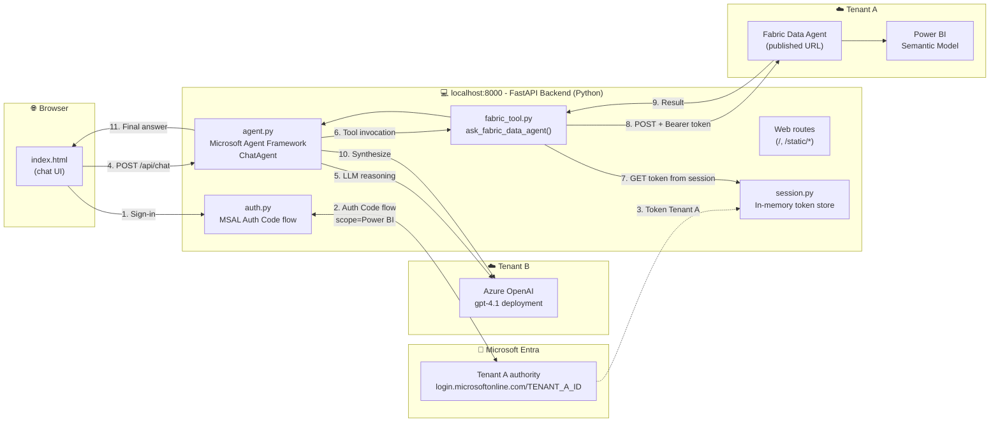
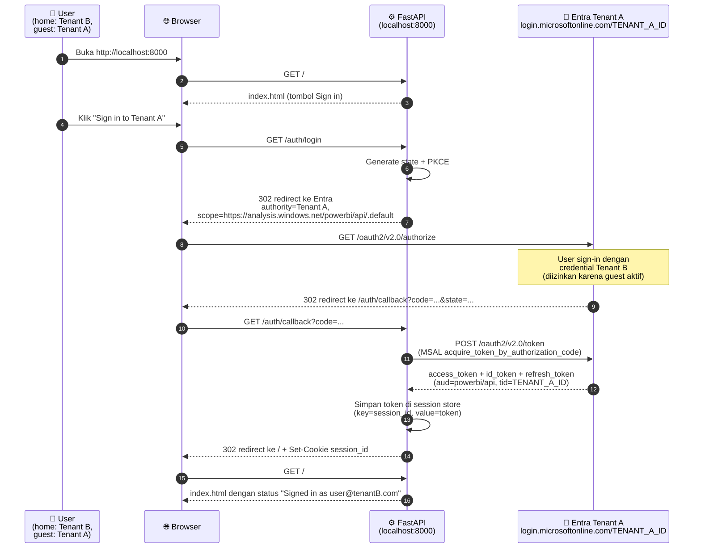
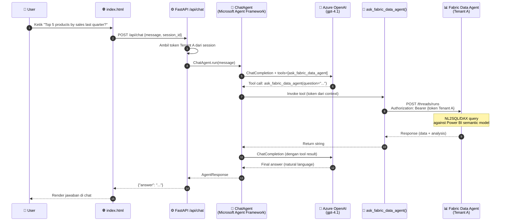
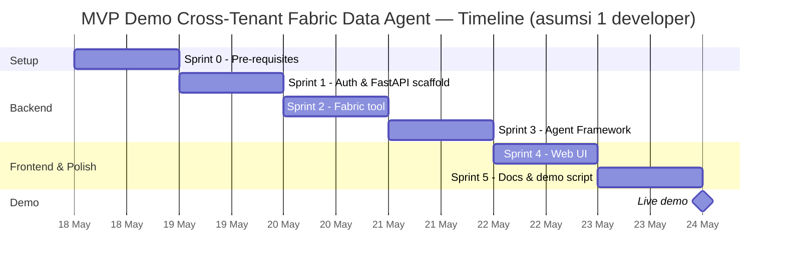

# Software Development Plan — MVP Demo Cross-Tenant Fabric Data Agent + Microsoft Agent Framework

> Dokumen ini adalah **rencana implementasi MVP** untuk mendemokan integrasi **Microsoft Fabric Data Agent (Tenant A)** ↔ **Microsoft Agent Framework + Azure OpenAI (Tenant B)** dengan user lintas tenant (Tenant B user sebagai *guest* di Tenant A). Sengaja dibuat **sesederhana mungkin** namun **100% selaras** dengan [proposal-agent-manager-cross-tenant.md (v1.4)](proposal-agent-manager-cross-tenant.md) dan Microsoft Learn.
>
> **Status:** Draft v1.1 — Mei 2026

---

## 1. Ringkasan Eksekutif

MVP ini membuktikan secara end-to-end bahwa **user dari Tenant B** dapat **bercakap** dengan **Microsoft Fabric Data Agent di Tenant A** melalui satu antarmuka web sederhana, dengan **orkestrasi LLM** menggunakan Microsoft Agent Framework. Pendekatan autentikasi yang dipakai adalah **Authorization Code flow langsung ke Tenant A** — pola *fallback* yang sudah divalidasi pada [proposal Bagian 6 catatan #2](proposal-agent-manager-cross-tenant.md) dan setara dengan **Fase 1 + Fase 2** pada roadmap proposal Bagian 10.

Hasil yang ingin ditunjukkan dalam 1 demo singkat:

1. User Tenant B (`user@tenantB.com`) dapat *sign-in* sebagai *guest* ke Tenant A.
2. Token *user-delegated* dengan audience Power BI / Analysis Services berhasil diterbitkan oleh Tenant A.
3. Pertanyaan natural language → Microsoft Agent Framework → tool `ask_fabric_data_agent` → jawaban berbasis data Fabric kembali dirangkai oleh LLM Azure OpenAI di Tenant B.
4. Seluruh alur **tidak menggunakan Service Principal** untuk Fabric Data Agent (sesuai larangan resmi Microsoft Learn).

---

## 2. Scope MVP

| Item | In MVP (Fase 1+2) | Out of MVP (Fase 3+) |
|---|---|---|
| Cross-tenant user identity | ✅ Auth Code flow langsung ke Tenant A | ❌ OBO penuh (Tenant B → Tenant A token exchange) |
| Tool yang terdaftar di Agent Manager | ✅ 1 tool: `ask_fabric_data_agent` | ❌ Foundry sub-agent, Azure AI Search, custom tools |
| LLM | ✅ Azure OpenAI (Tenant B) | ❌ Multi-model routing |
| Orchestrator | ✅ Microsoft Agent Framework `ChatAgent` (Python) | ❌ Workflows orchestrations (Handoff / Sequential / Magentic) |
| Konsumsi Fabric Data Agent | ✅ Assistants API published URL (Option B proposal §7.3.3) | ❌ MCP server (Option A proposal §7.3.2) |
| Web UI | ✅ Single-page vanilla HTML + JS | ❌ React/Vue SPA |
| Session/token cache | ✅ In-memory dict + cookie session | ❌ Redis + Key Vault |
| Deployment | ✅ Run lokal (`uvicorn`) | ❌ Azure Container Apps + Front Door |
| Logging | ✅ Structured stdout logging | ❌ App Insights + Audit Log pipeline |
| Multi-user concurrency | ⚠️ Mendukung 2-3 user demo | ❌ Production-grade |
| Hardening keamanan | ❌ Minimal (cukup untuk demo lokal) | ✅ Phase 4 (proposal §10) |

**Prinsip MVP:** *Setiap hal yang tidak menambah nilai demo dihapus.* Target keseluruhan: **< 600 lines kode**, **< 30 menit setup** untuk orang baru.

---

## 3. Arsitektur MVP



### 3.1 Komponen MVP

| Komponen | Bahasa/Library | Peran | Letak |
|---|---|---|---|
| **Web UI** | HTML + vanilla JS + CSS | Chat interface, sign-in button | Browser |
| **FastAPI app** | Python 3.11, FastAPI 0.115 | HTTP routes + static file server | `localhost:8000` |
| **MSAL Auth module** | `msal` 1.31 | Authorization Code flow ke Tenant A | Backend |
| **Session store** | Python dict + `itsdangerous` cookie | Cache token user (TTL 60 menit) | Backend memory |
| **Agent orchestrator** | `agent-framework` 1.0.0rc6 | `ChatAgent` + tool registry | Backend |
| **Fabric tool** | `openai` 1.70 (pola Assistants API) | Panggil Fabric Data Agent dengan custom `Authorization: Bearer <MSAL token>` — sesuai [Fabric end-to-end tutorial](https://learn.microsoft.com/fabric/data-science/data-agent-end-to-end-tutorial#use-the-fabric-data-agent-programmatically) | Backend |
| **LLM client** | `agent-framework-openai` + `azure-identity` | `OpenAIChatCompletionClient` ke Azure OpenAI | Backend |

---

## 4. Alur Autentikasi (Authorization Code Flow direct ke Tenant A)



**Konformitas dengan Microsoft Learn — dibuktikan:**

- ✅ `authority=https://login.microsoftonline.com/{TENANT_A_ID}` — WAJIB tenant spesifik untuk guest user (BUKAN `/common` atau `/organizations`). Sumber: [MSAL OBO — getting tokens on behalf of a user](https://learn.microsoft.com/entra/msal/dotnet/acquiring-tokens/web-apps-apis/on-behalf-of-flow#getting-tokens-on-behalf-of-a-user). Disebut pada [proposal §6 dan §7.3.4 catatan #2](proposal-agent-manager-cross-tenant.md).
- ✅ `scope=https://analysis.windows.net/powerbi/api/.default` (Power BI / Analysis Services). Sumber: [Use service principal authentication with Fabric data agent — Step 5](https://learn.microsoft.com/fabric/data-science/data-agent-service-principal#step-5-acquire-a-token-and-call-the-fabric-data-agent). Disebut pada [proposal §6 dan §7.3.1](proposal-agent-manager-cross-tenant.md).
- ✅ User identity (BUKAN Service Principal). Sumber: [Use the Microsoft Fabric data agent — prerequisites](https://learn.microsoft.com/azure/foundry/agents/how-to/tools/fabric#prerequisites) yang eksplisit: *"Use user identity authentication. Service principal authentication isn't supported for the Fabric data agent."*

---

## 5. Alur Chat End-to-End



---

## 6. Tech Stack & Dependencies

### 6.1 Runtime
- **Python 3.10+** (minimum yang dipersyaratkan oleh [Fabric Data Agent Python SDK](https://learn.microsoft.com/fabric/data-science/fabric-data-agent-sdk); 3.11 atau 3.12 direkomendasikan untuk kompatibilitas `agent-framework` 1.0.0rc6)
- **Node.js**: tidak dipakai
- **Browser**: Edge / Chrome / Firefox terbaru

### 6.2 `requirements.txt`

```text
# Web framework
fastapi==0.115.*
uvicorn[standard]==0.32.*
itsdangerous==2.2.*          # untuk SessionMiddleware

# Microsoft authentication
msal==1.31.*
azure-identity==1.19.*       # untuk AzureCliCredential pada Azure OpenAI

# Microsoft Agent Framework (sesuai proposal v1.4 — namespace baru)
agent-framework==1.0.0rc6
agent-framework-openai==1.0.0rc6

# OpenAI Python SDK — dipakai untuk pola Assistants API ke Fabric Data Agent
# (pola resmi: https://learn.microsoft.com/fabric/data-science/data-agent-end-to-end-tutorial#use-the-fabric-data-agent-programmatically)
openai==1.70.*

# Util
python-dotenv==1.0.*
httpx==0.27.*
pydantic==2.9.*
pydantic-settings==2.6.*
```

> **Catatan pilihan SDK:** MS Learn juga menyediakan paket [`fabric-data-agent-client`](https://learn.microsoft.com/fabric/data-science/consume-data-agent-python) untuk konsumsi eksternal, namun SDK tersebut mengikat ke `azure-identity.TokenCredential` (mis. `InteractiveBrowserCredential`). Karena MVP ini sudah mengakuisisi token via **MSAL Confidential Client di sisi server** (web app pattern), pola **subclass `OpenAI`** dengan injeksi header `Authorization: Bearer <token>` dari [Fabric end-to-end tutorial — *Use the Fabric data agent programmatically*](https://learn.microsoft.com/fabric/data-science/data-agent-end-to-end-tutorial#use-the-fabric-data-agent-programmatically) jauh lebih lurus dan minim *moving parts*. Selalu boleh migrasi ke `fabric-data-agent-client` di Fase 3 jika dibutuhkan.

### 6.3 `.env.example`

```bash
# === Tenant A (Fabric host) ===
TENANT_A_ID=00000000-0000-0000-0000-000000000000

# === Multi-tenant Application Registration (didaftar di Tenant B) ===
APP_CLIENT_ID=11111111-1111-1111-1111-111111111111
APP_CLIENT_SECRET=<dari Entra App Reg → Certificates & secrets>
APP_REDIRECT_URI=http://localhost:8000/auth/callback

# === Microsoft Fabric Data Agent (Tenant A) ===
# Copy nilai dari Fabric portal: Data Agent → Settings → "Published URL"
# (format URL bervariasi per environment & region — MS Learn tidak mengikat format konkret;
#  contoh placeholder: https://<environment>.fabric.microsoft.com/groups/<workspace_id>/aiskills/<artifact_id>)
FABRIC_AGENT_PUBLISHED_URL=<paste-published-base-url-dari-Fabric-portal>
FABRIC_WORKSPACE_ID=<guid-dari-URL-portal>
FABRIC_AGENT_ID=<artifact-id-dari-URL-portal>

# === Azure OpenAI (Tenant B) ===
AZURE_OPENAI_ENDPOINT=https://<resource>.openai.azure.com
AZURE_OPENAI_DEPLOYMENT=gpt-4.1
AZURE_OPENAI_API_VERSION=2024-10-21

# === Session ===
SESSION_SECRET_KEY=<random 32+ char hex string>
```

---

## 7. Prerequisites (One-time Setup)

### 7.1 Di Microsoft Entra

| # | Aksi | Pelaksana | Bukti / cara verifikasi |
|---|---|---|---|
| 1 | Daftarkan **App Registration multi-tenant** di Tenant B | Developer | Entra portal → App registrations → New → "Accounts in any organizational directory" |
| 2 | Tambah **Redirect URI** `http://localhost:8000/auth/callback` (tipe Web) | Developer | App Reg → Authentication |
| 3 | Tambah **Delegated permission** Power BI Service (Tenant.Read.All atau scope dinamis `https://analysis.windows.net/powerbi/api/.default`) | Developer | App Reg → API permissions |
| 4 | Generate **client secret** | Developer | App Reg → Certificates & secrets |
| 5 | Lakukan **admin consent di Tenant A**: `https://login.microsoftonline.com/{TENANT_A_ID}/adminconsent?client_id={APP_ID}` | Global Admin Tenant A | Konsen sukses → app muncul di Tenant A → Enterprise applications |
| 6 | Pastikan **Cross-Tenant Access Settings** Tenant A → Inbound mengizinkan aplikasi ini | Identity Admin Tenant A | Entra → External Identities → Cross-tenant access settings |

### 7.2 Di Microsoft Fabric (Tenant A)

| # | Aksi | Bukti |
|---|---|---|
| 1 | Fabric Capacity F2+ aktif | Fabric Admin Portal |
| 2 | Workspace dengan Power BI semantic model + data | Workspace UI |
| 3 | Fabric Data Agent dibuat dan **di-publish** | Data Agent UI → Status: Published |
| 4 | Catat `workspace_id`, `agent_id`, `published_url` (Assistants API endpoint) | Data Agent UI → Settings |
| 5 | Aktifkan tenant setting **cross-geo processing & cross-geo storing for AI** (untuk konsumsi data agent dari luar region) | Fabric Admin Portal → Tenant settings (lihat [Fabric data agent tenant settings](https://learn.microsoft.com/fabric/data-science/data-agent-tenant-settings)) |
| 6 | Aktifkan tenant setting **Copilot and other features powered by Azure OpenAI** | Fabric Admin Portal → Tenant settings |

### 7.3 Izin User Demo (cumulative)

| Tempat | Peran/Izin | Sumber MS Learn |
|---|---|---|
| Tenant A (sebagai guest) | Guest user aktif | [Cross-tenant B2B](https://learn.microsoft.com/entra/external-id/b2b-fundamentals) |
| Fabric Workspace | Contributor (atau Member) | [Workspace roles](https://learn.microsoft.com/fabric/fundamentals/roles-workspaces) |
| Fabric Data Agent | Read | [Data agent sharing](https://learn.microsoft.com/fabric/data-science/data-agent-sharing) |
| Power BI Semantic Model | **Build** (Read saja tidak cukup) | [Use the Microsoft Fabric data agent — prerequisites](https://learn.microsoft.com/azure/foundry/agents/how-to/tools/fabric#prerequisites) |

### 7.4 Di Azure OpenAI (Tenant B)

| # | Aksi |
|---|---|
| 1 | Azure OpenAI resource aktif di subscription Tenant B |
| 2 | Model deployment (mis. `gpt-4.1`) sudah aktif |
| 3 | Developer punya role `Cognitive Services OpenAI User` agar `AzureCliCredential` bisa autentikasi |
| 4 | `az login` sudah dijalankan di mesin developer |

---

## 8. Project Structure

```
fabric_cross_tenant/
├── proposal-agent-manager-cross-tenant.md          # existing — sumber arsitektur
├── README.md                                        # existing
├── demo-mvp-plan.md                                 # ⬅ dokumen ini
└── demo/                                            # ⬅ dibuat saat Sprint 1
    ├── README.md                                    # panduan run demo
    ├── requirements.txt
    ├── .env.example
    ├── run.sh                                       # `uvicorn app.main:app --reload`
    ├── app/
    │   ├── __init__.py
    │   ├── main.py                                  # FastAPI app + routes
    │   ├── config.py                                # baca .env dengan pydantic
    │   ├── auth.py                                  # MSAL Auth Code flow ke Tenant A
    │   ├── session.py                               # in-memory session store
    │   ├── fabric_tool.py                           # ask_fabric_data_agent()
    │   ├── agent.py                                 # ChatAgent setup
    │   └── logging_setup.py                         # structured logging
    └── static/
        ├── index.html                               # single-page UI
        ├── app.js                                   # vanilla JS chat logic
        └── style.css                                # minimal CSS
```

**Estimasi total LOC:** ~500-600 line (target simplicity).

---

## 9. Development Plan — 5 Sprint

### Sprint 0 — Pre-requisites (no code, ~2 jam)

**Output:** `.env` berisi seluruh nilai dari Bagian 6.3 yang terisi.

**Acceptance:**
- [ ] App Reg di Tenant B selesai, admin consent di Tenant A sukses
- [ ] User demo bisa sign-in ke Tenant A (test manual di `myapps.microsoft.com`)
- [ ] Fabric Data Agent published URL responds ke `curl` dengan token manual (test dari Azure CLI: `az account get-access-token --scope https://analysis.windows.net/powerbi/api/.default`)
- [ ] Azure OpenAI deployment menjawab via `curl` test

---

### Sprint 1 — Backend Scaffold + Authentication (~4 jam)

**Goal:** User bisa sign-in via browser, token Tenant A tersimpan di session.

**Tasks:**
1. Inisialisasi project (`demo/` folder, `requirements.txt`, `.env.example`)
2. `app/config.py` — load `.env` via pydantic-settings
3. `app/session.py` — `SessionStore` class (dict in-memory, TTL 60 menit)
4. `app/auth.py` — wrapper MSAL `ConfidentialClientApplication` dengan authority Tenant A
5. `app/main.py` — FastAPI dengan `SessionMiddleware`, routes:
   - `GET /` → return static index.html (placeholder)
   - `GET /auth/login` → bangun auth URL, redirect
   - `GET /auth/callback` → tukar code → token → simpan session → redirect `/`
   - `GET /auth/me` → return `{ "upn": ..., "tenant_id_token": ... }` atau 401
   - `POST /auth/logout` → clear session

**Acceptance:**
- [ ] `uvicorn app.main:app --reload` jalan tanpa error
- [ ] Browser → `http://localhost:8000/auth/login` → diarahkan ke `login.microsoftonline.com/{TENANT_A_ID}/...` (verify TENANT_A_ID di URL)
- [ ] Sign-in dengan akun guest user → kembali ke `/auth/callback` sukses
- [ ] `/auth/me` mengembalikan UPN user Tenant B
- [ ] **Manual verify JWT:** decode `access_token` di `jwt.ms` → `aud` mengandung `https://analysis.windows.net/powerbi/api`, `tid` = `TENANT_A_ID`

---

### Sprint 2 — Fabric Data Agent Tool (~3 jam)

**Goal:** Backend bisa kirim pertanyaan ke Fabric Data Agent dan kembalikan jawaban (tanpa LLM dulu).

**Tasks:**
1. `app/fabric_tool.py` — implementasikan fungsi `ask_fabric_data_agent(question: str, token: str) -> str`:
   - **Pola yang dipakai:** subclass `openai.OpenAI` dan override `_prepare_options` untuk inject header `Authorization: Bearer <token>` (token MSAL dari session). Ini adalah pola yang **eksplisit** dicontohkan MS Learn pada [Fabric data agent end-to-end tutorial — *Use the Fabric data agent programmatically*](https://learn.microsoft.com/fabric/data-science/data-agent-end-to-end-tutorial#use-the-fabric-data-agent-programmatically).
   - Set `base_url = FABRIC_AGENT_PUBLISHED_URL`, lalu pakai `client.beta.assistants.create()`, `threads.create()`, `messages.create()`, `runs.create()`, polling status (timeout 300s), `messages.list()`.
   - Wajib: cleanup thread setelah selesai (`client.beta.threads.delete(thread_id=thread.id)`) sesuai best practice MS Learn.
2. Tambah endpoint smoke test `POST /api/fabric-direct` di `main.py` — terima `{question}`, ambil token dari session, panggil tool, return raw response

**Acceptance:**
- [ ] `curl -X POST http://localhost:8000/api/fabric-direct -H "Cookie: session=..." -d '{"question":"sample 5 rows"}'` → return data nyata dari Fabric
- [ ] Latensi < 10 detik untuk pertanyaan sederhana
- [ ] Log menampilkan workspace_id + agent_id yang dipanggil (audit trail dasar)

---

### Sprint 3 — Microsoft Agent Framework Orchestrator (~4 jam)

**Goal:** LLM Azure OpenAI memutuskan kapan memanggil tool Fabric, dan menyusun jawaban final.

**Tasks:**
1. `app/agent.py` — buat:
   - `OpenAIChatCompletionClient` dengan `AzureCliCredential` (sesuai proposal §7.3.4)
   - Wrapper fungsi `make_fabric_tool(session_token)` yang return closure berisi token user — closure ini dipakai sebagai tool function untuk `ChatAgent` agar token user-specific
   - `ChatAgent` per-request (atau pool) dengan instructions yang jelas: *"Use fabric_query tool for any question about sales, customers, or products."*
2. Endpoint `POST /api/chat` di `main.py`:
   - Validate session → return 401 jika belum sign-in
   - Build per-user `ChatAgent` dengan token user
   - `await agent.run(user_message)` → return `{"answer": str(result)}`

**Acceptance:**
- [ ] Pertanyaan business ("top 5 product by sales last month") → LLM panggil tool → jawaban natural language
- [ ] Pertanyaan small-talk ("hello") → LLM TIDAK panggil tool, jawab langsung
- [ ] Log menampilkan: prompt → tool invocation → tool result → final response
- [ ] Token TIDAK pernah muncul di log response (security check)

---

### Sprint 4 — Frontend Chat UI (~3 jam)

**Goal:** Web UI sederhana yang bisa dipakai non-developer.

**Tasks:**
1. `static/index.html` — struktur:
   - Header: judul + status sign-in (UPN atau tombol "Sign in")
   - Main: scrollable chat history (user vs assistant bubble)
   - Footer: input textarea + tombol Send (Enter to submit, Shift+Enter newline)
2. `static/app.js` — vanilla JS:
   - On load: fetch `/auth/me` → tampilkan UPN atau tombol redirect ke `/auth/login`
   - On Send: POST `/api/chat` → append user msg, show "thinking..." indicator, append assistant msg
   - Markdown render sederhana (header, bold, code block) atau pakai `marked.min.js` via CDN
3. `static/style.css` — flexbox layout, gradient subtle, max-width 800px center, font system-ui

**Acceptance:**
- [ ] Buka browser di mode incognito → klik Sign In → flow sukses → ketik pertanyaan → lihat jawaban dirender
- [ ] Resize browser → layout tetap rapi (responsive minimal)
- [ ] Pertanyaan multi-line bisa dikirim (Shift+Enter)
- [ ] Tampilan tidak menggunakan framework heavy (cek dengan DevTools)

---

### Sprint 5 — Polish, Documentation & Demo Script (~2 jam)

**Goal:** Demo siap dipakai oleh orang lain tanpa hand-holding.

**Tasks:**
1. `demo/README.md` — panduan setup step-by-step:
   - Prasyarat (link ke Bagian 7 dokumen ini)
   - Setup `.env`
   - `pip install -r requirements.txt`
   - `bash run.sh`
   - Daftar 5 pertanyaan contoh yang work
2. Error handling:
   - Token expired (HTTP 401 dari Fabric) → frontend tampilkan "Session expired, please sign in again" + redirect `/auth/login`
   - Fabric Data Agent error (500) → frontend tampilkan pesan ramah
3. Logging structured (JSON) untuk: sign-in event, chat request, tool invocation, response time
4. Tambah demo script di README: *"Buka browser → Sign in → Tanya 1: ... → Tanya 2: ..."*

**Acceptance:**
- [ ] Developer baru clone repo → ikuti `demo/README.md` → demo running dalam ≤30 menit (timer test)
- [ ] Semua 5 pertanyaan demo berhasil
- [ ] `git log` clean, commit message deskriptif

---

## 10. Timeline Sprint (visualisasi)



**Total durasi:** 6 hari kerja untuk satu developer (≈ 18 jam kerja efektif). Dapat dipotong menjadi 3 hari jika ada 2 developer (frontend + backend paralel mulai Sprint 4).

---

## 11. Testing & Validation

### 11.1 Manual Test Cases (cukup untuk MVP)

| # | Skenario | Hasil yang diharapkan |
|---|---|---|
| T1 | Cold start sign-in | Redirect ke Tenant A, sukses callback, UPN tampil di header |
| T2 | Pertanyaan business ("top 5 customers by revenue") | LLM panggil `ask_fabric_data_agent`, jawaban berisi data nyata |
| T3 | Pertanyaan small-talk ("hello") | LLM jawab langsung, TIDAK panggil tool |
| T4 | Token expired (tunggu >1 jam atau hapus manual) | Pertanyaan berikutnya gagal dengan 401, UI minta re-login |
| T5 | User non-guest mencoba sign-in (e.g., user random) | Entra Tenant A menolak; error ditampilkan di UI |
| T6 | Logout → coba akses /api/chat | 401 Unauthorized |

### 11.2 Verifikasi konformitas Microsoft Learn

Setelah Sprint 1 sukses, lakukan **JWT decoding** (mis. di [jwt.ms](https://jwt.ms)) untuk membuktikan:

| Klaim JWT | Nilai yang diharapkan | Mengapa |
|---|---|---|
| `aud` (audience) | `https://analysis.windows.net/powerbi/api` (atau GUID Power BI) | Konfirmasi Power BI scope, bukan Fabric REST API |
| `tid` (tenant ID) | `{TENANT_A_ID}` | Konfirmasi token diterbitkan oleh Tenant A, bukan Tenant B |
| `iss` (issuer) | `https://sts.windows.net/{TENANT_A_ID}/` atau `https://login.microsoftonline.com/{TENANT_A_ID}/v2.0` | Konfirmasi authority Tenant A |
| `upn` atau `preferred_username` | Email user Tenant B (e.g., `user@tenantB.com`) | Konfirmasi user identity, bukan SP |
| `idtyp` | `user` (atau tidak ada `app`) | Konfirmasi BUKAN application token / SP |

Bila keempat klaim ini benar, maka MVP **secara teknis terbukti** mengikuti pola resmi Microsoft Learn.

### 11.3 Acceptance Criteria Global MVP

- ✅ Demo berjalan di laptop developer, tanpa deploy Azure
- ✅ Total kode produksi < 600 baris
- ✅ Latensi end-to-end (pertanyaan → jawaban) < 15 detik untuk pertanyaan sederhana
- ✅ Tidak ada bearer token di log/response client
- ✅ Cukup 1 developer untuk setup + jalankan, ≤ 30 menit dari clone repo

---

## 12. Demo Script (untuk live presentation)

> Asumsikan setup Bagian 7 selesai dan `uvicorn` jalan.

1. **[0:00]** Buka browser di mode incognito → `http://localhost:8000` → tunjukkan halaman dengan tombol "Sign in to Tenant A"
2. **[0:30]** Klik "Sign in" → tunjukkan URL `login.microsoftonline.com/{TENANT_A_ID}/...` (sorot TENANT_A_ID di URL untuk membuktikan authority Tenant A)
3. **[1:00]** Sign-in dengan akun Tenant B → setelah callback, header berubah jadi "Signed in as `user@tenantB.com`"
4. **[1:30]** **(Opsional)** Tunjukkan DevTools Network → ambil cookie session → di backend log, decode JWT → tunjukkan `aud=powerbi/api` dan `tid=TENANT_A_ID`
5. **[2:00]** Tanya pertanyaan 1: *"What are the top 5 products by sales quantity last quarter?"* → tunjukkan response
6. **[2:30]** Tunjukkan backend log: prompt → tool call `ask_fabric_data_agent` → response Fabric → final answer
7. **[3:00]** Tanya pertanyaan 2: *"Compare sales of product X vs product Y"*
8. **[3:30]** Tanya pertanyaan 3 (small talk): *"Hello, who are you?"* → tunjukkan TIDAK ada tool call (LLM jawab langsung)
9. **[4:00]** Tanya pertanyaan 4: *"Show monthly sales trend for 2025"*
10. **[4:30]** Recap: cross-tenant ✅, user identity ✅, no SP ✅, Agent Framework orchestrator ✅, semuanya sesuai proposal v1.4 + MS Learn

**Total durasi demo:** ≈ 5 menit.

---

## 13. Alignment Matrix — MVP ↔ Proposal v1.4 ↔ Microsoft Learn

| Keputusan MVP | Proposal §  | Sumber MS Learn |
|---|---|---|
| User-delegated token (BUKAN Service Principal) | §1.1, §3.2 | [Use the Microsoft Fabric data agent — prereq #7](https://learn.microsoft.com/azure/foundry/agents/how-to/tools/fabric#prerequisites) |
| Authority spesifik Tenant A (bukan `/common`) | §6, §7.3.4 catatan #2 | [MSAL OBO — guest users](https://learn.microsoft.com/entra/msal/dotnet/acquiring-tokens/web-apps-apis/on-behalf-of-flow#getting-tokens-on-behalf-of-a-user) |
| Power BI scope `https://analysis.windows.net/powerbi/api/.default` | §6, §7.1, §7.3.1 | [Use service principal authentication with Fabric data agent — Step 5](https://learn.microsoft.com/fabric/data-science/data-agent-service-principal#step-5-acquire-a-token-and-call-the-fabric-data-agent) |
| Auth Code flow langsung ke Tenant A (sebagai pengganti OBO untuk MVP) | §6 catatan #2 *(fallback yang divalidasi)*, §10 Fase 1 | [OAuth 2.0 Authorization Code flow](https://learn.microsoft.com/entra/identity-platform/v2-oauth2-auth-code-flow) |
| Multi-tenant Application Registration | §7.1 | [Convert single-tenant app to multi-tenant](https://learn.microsoft.com/entra/identity-platform/howto-convert-app-to-be-multi-tenant) |
| Admin consent di Tenant A | §7.1 | [Admin consent endpoint](https://learn.microsoft.com/entra/identity/enterprise-apps/grant-admin-consent) |
| Cross-Tenant Access Settings inbound | §6 catatan #2 | [Cross-tenant access settings](https://learn.microsoft.com/entra/external-id/cross-tenant-access-overview) |
| User butuh Build permission di Power BI semantic model | §7.1 (Izin User) | [Underlying data source permissions](https://learn.microsoft.com/fabric/data-science/data-agent-sharing#underlying-data-source-permissions) |
| Fabric Capacity F2+ | §7.1 (Tenant A) | [Fabric features parity](https://learn.microsoft.com/fabric/enterprise/fabric-features) |
| Microsoft Agent Framework `ChatAgent` + tool function | §7.3.4 | [Agent Framework overview](https://learn.microsoft.com/agent-framework/overview/) |
| Namespace `agent_framework.openai.OpenAIChatCompletionClient` | §7.3 catatan, §7.3.4 catatan #1 | [Python 2026 Significant Changes Guide](https://learn.microsoft.com/agent-framework/support/upgrade/python-2026-significant-changes) |
| Konsumsi via Assistants API published URL (BUKAN MCP untuk MVP) | §7.3.3 (Option B) | [Fabric Data Agent end-to-end tutorial — programmatic use](https://learn.microsoft.com/fabric/data-science/data-agent-end-to-end-tutorial#use-the-fabric-data-agent-programmatically) |
| Pola subclass `openai.OpenAI` dengan injeksi `Authorization: Bearer <MSAL token>` (untuk web app server-side) | §7.3.3 | [Fabric Data Agent end-to-end tutorial — `FabricOpenAI` class](https://learn.microsoft.com/fabric/data-science/data-agent-end-to-end-tutorial#use-the-fabric-data-agent-programmatically) |
| Paket alternatif `fabric-data-agent-client` (untuk klien interaktif berbasis `azure-identity`) — tidak dipakai MVP web app | §7.3.3 | [Consume a Fabric data agent with the Python client SDK](https://learn.microsoft.com/fabric/data-science/consume-data-agent-python) |
| Roadmap (Fase 1 POC + Fase 2 MVP) | §10 | — |

---

## 14. Future Enhancements (Out of MVP — link ke Phase 3+ proposal)

Setelah MVP terbukti, peningkatan berikut bisa dilakukan secara incremental tanpa membongkar arsitektur:

| Peningkatan | Proposal § | Catatan |
|---|---|---|
| Migrasi tool dari Assistants API ke **MCP** | §7.3.2 (Option A) | Tukar `fabric_tool.py` dengan `MCPStreamableHTTPTool` + `header_provider`. Memerlukan Fabric Data Agent MCP server di-aktifkan dari UI Fabric (preview). |
| Tambah **Foundry sub-agent** sebagai tool ke-2 | §5.2, §7.2 | Demo multi-tool orchestration |
| Implementasi **OBO penuh** (user sign-in ke Tenant B, OBO ke Tenant A) | §7.3.1 | Untuk skenario SaaS dengan banyak Tenant A pelanggan |
| **Token cache di Redis** + secret di Key Vault | §8 | Fase 4 hardening |
| Deploy ke **Azure Container Apps** dengan Front Door | §9 | Fase 4 |
| **Audit log** ke App Insights + alerting | §8, §10 Fase 4 | Compliance |
| **Conditional Access** + MFA enforcement | §8 | Untuk produksi enterprise |
| Multi-region & autoscale | §10 Fase 5 | Enterprise rollout |

---

## 15. Referensi (Subset — hanya yang dipakai MVP)

### Microsoft Fabric Data Agent
- [Use the Microsoft Fabric data agent (preview)](https://learn.microsoft.com/azure/foundry/agents/how-to/tools/fabric) — prereq, identity passthrough, SP not supported
- [Use service principal authentication with Fabric data agent — Step 5](https://learn.microsoft.com/fabric/data-science/data-agent-service-principal#step-5-acquire-a-token-and-call-the-fabric-data-agent) — Power BI scope source of truth
- [Fabric Data Agent end-to-end tutorial — programmatic use](https://learn.microsoft.com/fabric/data-science/data-agent-end-to-end-tutorial#use-the-fabric-data-agent-programmatically) — **pola `FabricOpenAI` subclass** yang dipakai MVP
- [Consume a Fabric data agent with the Python client SDK](https://learn.microsoft.com/fabric/data-science/consume-data-agent-python) — referensi `fabric-data-agent-client` (alternatif, tidak dipakai MVP)
- [Fabric Data Agent Python SDK (in-notebook)](https://learn.microsoft.com/fabric/data-science/fabric-data-agent-sdk) — Python version requirement (≥3.10)
- [Configure Fabric data agent tenant settings](https://learn.microsoft.com/fabric/data-science/data-agent-tenant-settings)

### Microsoft Entra & Authentication
- [MSAL Python — Authorization Code flow](https://learn.microsoft.com/entra/msal/python/getting-started/acquiring-tokens#acquiring-tokens-interactively)
- [MSAL — getting tokens on behalf of a user (guest user authority requirement)](https://learn.microsoft.com/entra/msal/dotnet/acquiring-tokens/web-apps-apis/on-behalf-of-flow#getting-tokens-on-behalf-of-a-user)
- [Cross-tenant access settings overview](https://learn.microsoft.com/entra/external-id/cross-tenant-access-overview)
- [Convert single-tenant app to multi-tenant](https://learn.microsoft.com/entra/identity-platform/howto-convert-app-to-be-multi-tenant)
- [Admin consent endpoint](https://learn.microsoft.com/entra/identity/enterprise-apps/grant-admin-consent)

### Microsoft Agent Framework
- [Microsoft Agent Framework — overview](https://learn.microsoft.com/agent-framework/overview/)
- [Python 2026 Significant Changes Guide](https://learn.microsoft.com/agent-framework/support/upgrade/python-2026-significant-changes) — namespace baru `agent_framework.openai`

### Azure OpenAI
- [Azure OpenAI — authentication with `AzureCliCredential`](https://learn.microsoft.com/python/api/overview/azure/identity-readme#azureclicredential)

---

*Status dokumen: Draft v1.1 — selaras dengan [proposal v1.4](proposal-agent-manager-cross-tenant.md) dan Microsoft Learn (Mei 2026). Siap dieksekusi.*
