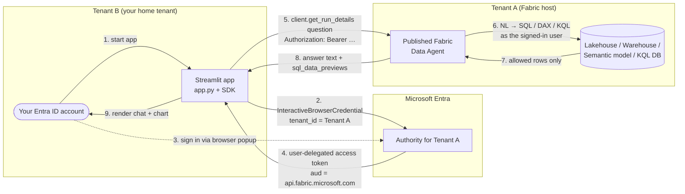
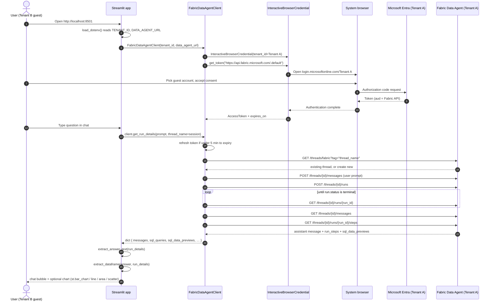

# Fabric Cross-Tenant Demo (Python client SDK)

Streamlit chat app for a **Microsoft Fabric Data Agent** — cross-tenant
scenario, interactive Microsoft Entra ID sign-in only.

**Reference:** [Consume a Fabric data agent with the Python client SDK (preview)](https://learn.microsoft.com/fabric/data-science/consume-data-agent-python).

> **Preview notice.** Fabric Data Agent and its Python client SDK are in
> [Public Preview](https://learn.microsoft.com/fabric/fundamentals/preview).
> APIs, endpoints, and behavior may change without notice.

---

## What this demo does



There is **no orchestrator, no Azure OpenAI in Tenant B, no MCP server, no
custom app registration**. The official Microsoft sample SDK
([microsoft/fabric_data_agent_client](https://github.com/microsoft/fabric_data_agent_client),
MIT-licensed, single Python file) handles:

- Interactive browser auth via
  [`azure.identity.InteractiveBrowserCredential`](https://learn.microsoft.com/python/api/azure-identity/azure.identity.interactivebrowsercredential).
- Automatic bearer-token refresh against the scope
  `https://api.fabric.microsoft.com/.default` (refresh 5 minutes before expiry).
- Assistants-API calls to the Fabric Data Agent: create assistant → thread →
  message → run → poll → fetch reply → delete thread.
- Optional **named threads** for multi-turn conversation persistence.

This app layers a thin **client-side chart renderer** on top of the SDK — see
[Chart rendering](#chart-rendering) below.

The cross-tenant part works because the credential is created with
`tenant_id=<Tenant A>` — when the browser opens, the account picker shows any
account that can sign in to Tenant A, **including
[Microsoft Entra B2B guest accounts](https://learn.microsoft.com/entra/external-id/what-is-b2b)
whose home tenant is Tenant B**.

### Detailed sequence (auth + one chat turn)



---

## Folder contents

| File | Purpose |
|---|---|
| [app.py](app.py) | Streamlit chat UI — sign-in gate, sidebar (tenant/URL/thread, new conversation, sign out), chat history with **chart rendering**, per-session stable thread name. |
| [chart_utils.py](chart_utils.py) | Client-side helpers: extract answer text + DataFrame from a run, infer a chart type, and render with Streamlit native charts. See [Chart rendering](#chart-rendering). |
| [fabric_data_agent_client.py](fabric_data_agent_client.py) | Microsoft's official sample SDK (MIT). See [SDK note](#sdk-note) below for the one tiny local edit. |
| [requirements.txt](requirements.txt) | `streamlit`, `azure-identity`, `openai`, `requests`, `python-dotenv`, `pandas` (floor-pinned). |
| [.env.example](.env.example) | Template with the 2 required values (`TENANT_ID`, `DATA_AGENT_URL`). |
| `.env` | Your local copy (git-ignored — never commit real values). |

---

## Prerequisites

All three live in **Tenant A** (the tenant that hosts Fabric):

1. A paid **F2 (or higher) Fabric capacity**, or a **Power BI Premium P1+**
   capacity with [Microsoft Fabric enabled](https://learn.microsoft.com/fabric/admin/fabric-switch)
   ([feature parity list](https://learn.microsoft.com/fabric/enterprise/fabric-features)).
2. Tenant setting **"Cross-geo processing for AI"** / **"Cross-geo storing for AI"** enabled per
   [Fabric data agent tenant settings](https://learn.microsoft.com/fabric/data-science/data-agent-tenant-settings),
   if your capacity is in a different geo than your data.
3. A **published** Fabric Data Agent backed by at least one supported data
   source: Lakehouse, Warehouse, Power BI semantic model, KQL DB, mirrored DB,
   or ontology.

In **Tenant B** (your home tenant):

4. Your Microsoft Entra ID account has been **invited as a guest** in Tenant A
   ([Add B2B guest users](https://learn.microsoft.com/entra/external-id/b2b-quickstart-add-guest-users-portal))
   and the invitation is accepted.
5. The guest account has **read** access to the data source bound to the
   Fabric Data Agent.

On your laptop:

6. Python **3.9+** (3.11 recommended).
7. A default web browser that can open `login.microsoftonline.com`.

> No app registration needed. `InteractiveBrowserCredential` defaults to the
> well-known Azure CLI public client (`04b07795-…`), which is already consented
> for Fabric scopes in most tenants.

---

## Setup

```pwsh
cd c:\mycodes\fabric_cross_tenant\demo

# 1. Configure the two values
Copy-Item .env.example .env
notepad .env       # fill in TENANT_ID and DATA_AGENT_URL

# 2. Create venv + install dependencies
python -m venv .venv
.\.venv\Scripts\Activate.ps1
pip install -r requirements.txt
```

### Where to find the values

- **`TENANT_ID`** — Tenant A's tenant ID. Azure portal → **Microsoft Entra ID** → **Overview** → **Tenant ID**. Format: GUID.
- **`DATA_AGENT_URL`** — Fabric portal → open your **published Data Agent** → **Settings** → **Published endpoint** → copy the OpenAI URL.
  Format:
  ```
  https://api.fabric.microsoft.com/v1/workspaces/<workspace-id>/dataagents/<agent-id>/aiassistant/openai
  ```

---

## Run

```pwsh
streamlit run app.py
```

If the venv is not activated, use the venv's Python directly:

```pwsh
.\.venv\Scripts\python.exe -m streamlit run app.py
```

Then in your browser at `http://localhost:8501`:

1. The app shows the spinner **"🔐 Opening browser for Entra ID sign-in…"**
   and pops your default browser to `login.microsoftonline.com`.
2. Pick your Entra ID account (the one that is a guest in Tenant A). On the
   very first run, approve the consent dialog (one time only).
3. The sign-in tab shows **"Authentication complete. You can close this window."**
   and Streamlit advances to the chat UI.
4. Type a question. Each turn calls
   `client.ask(prompt, thread_name=<stable per-session name>)` so follow-up
   questions keep context within the session.

**Sidebar controls:**

- **🆕 New conversation** — generates a new thread name and clears chat
  history (starts a fresh agent thread on the next message).
- **🚪 Sign out** — drops the cached credential. The next message re-opens
  the browser sign-in.

---

## Chart rendering

The Fabric Data Agent **does not generate chart images itself**. Per
[Fabric data agent concepts](https://learn.microsoft.com/fabric/data-science/concept-data-agent),
the agent uses Azure OpenAI Assistants APIs to translate natural language into
**SQL / DAX / KQL / Microsoft Graph** queries, executes those queries with the
caller's identity (read-only), and returns a structured, human-readable
answer. Image generation (a.k.a. *Code Interpreter*) is **only** available in
adjacent surfaces — [Microsoft Foundry agents](https://learn.microsoft.com/azure/foundry/agents/how-to/tools/code-interpreter),
[Copilot Studio prompts](https://learn.microsoft.com/microsoft-copilot-studio/code-interpreter-prompts-examples),
[Microsoft 365 Copilot extensibility](https://learn.microsoft.com/microsoft-365/copilot/extensibility/code-interpreter)
— not in the Fabric Data Agent.

**This demo therefore renders charts on the client** from whichever tabular
shape the agent gives us. Each turn calls
[`client.get_run_details(prompt, thread_name=…)`](fabric_data_agent_client.py)
once (single round-trip) and the dict it returns contains, per
[the MS Learn SDK reference](https://learn.microsoft.com/fabric/data-science/consume-data-agent-python#ask-the-data-agent-a-question):

- `messages` — full Assistants-API message list. We pull the latest assistant
  text via [`extract_answer_text()`](chart_utils.py).
- `sql_queries` — every SQL/DAX/KQL the agent ran.
- `sql_data_previews` — a markdown-formatted preview of each query's rows.

[`extract_dataframe()`](chart_utils.py) then tries, in order:

1. Parse the first GitHub-flavored markdown table inside the assistant's text
   answer (the most common shape for tabular Lakehouse / Warehouse / KQL
   questions — the LLM already renders one inline).
2. Fall back to `sql_data_previews` and parse the first markdown table there.

If a `pandas.DataFrame` is obtained, the chat bubble shows a **📊 Chart**
expander with a chart-type picker (Auto, Bar, Line, Area, Scatter, Table only).
[`infer_chart_type()`](chart_utils.py) picks a sensible default:

- ≥1 categorical + ≥1 numeric column → **Bar**
- only numeric columns, ≥2 → **Scatter**
- otherwise → **Table only**

Rendering uses Streamlit's built-in charts
([`st.bar_chart` / `line_chart` / `area_chart` / `scatter_chart`](https://docs.streamlit.io/develop/api-reference/charts))
with `x` / `y` chosen from the inferred numeric / non-numeric columns. No
extra plotting library is required.

**Try it.** A prompt like:

> *"Show the top 5 products by revenue last quarter as a markdown table."*

reliably triggers an inline table and therefore an auto-rendered bar chart.

### Limitations

- If the agent's answer contains no markdown table **and** no
  `sql_data_previews` (e.g. a single-number answer, a free-form summary, or a
  Power BI semantic-model answer that didn't produce a preview), no chart
  expander is shown.
- Numeric coercion strips `,`, `$`, `€`, `%`. Other formats (e.g. `K` / `M`
  suffixes, ISO dates as the X axis) currently render as strings.
- Data is parsed from the agent's own preview text. For very wide / very long
  query results the agent may truncate; in that case the chart reflects the
  truncated preview, not the full underlying result set.

---

## SDK note

[`fabric_data_agent_client.py`](fabric_data_agent_client.py) is a verbatim
copy of the file from
[microsoft/fabric_data_agent_client](https://github.com/microsoft/fabric_data_agent_client)
**with one tiny local edit**:

```python
return OpenAI(
    api_key="not-used",   # was: api_key=""
    base_url=self.data_agent_url,
    …
    default_headers={"Authorization": f"Bearer {self.token.token}", …},
)
```

Recent versions of the [`openai` Python SDK](https://github.com/openai/openai-python)
(v2.x) raise `Missing credentials. Please pass an api_key, …` when the
constructor receives an empty string. Auth is still done **only** via the
`Authorization: Bearer …` header containing the Microsoft Entra access token;
the `api_key` value is never sent to Fabric.

Pull updates from upstream when the official sample is updated and re-apply
this one-line change if needed.

---

## Troubleshooting

| Symptom | Likely cause / fix |
|---|---|
| `Missing required environment variable(s): TENANT_ID, DATA_AGENT_URL` | `.env` not present, in the wrong folder, or values empty. Confirm `demo/.env` exists alongside `app.py`. |
| Spinner stuck at **"🔐 Opening browser for Entra ID sign-in…"** | Default browser didn't open, or popup was blocked. Look in your taskbar for a new browser tab to `login.microsoftonline.com`. |
| `AADSTS50020` (user not authorized in tenant) | Your Tenant B account isn't a guest in Tenant A, or you haven't accepted the B2B invitation yet. |
| `AADSTS65001` (consent required) | First-time sign-in — accept the consent. If admin consent is required for the well-known Azure CLI app in Tenant A, ask the Tenant A admin to consent. |
| `Missing credentials. Please pass an api_key, …` | The [SDK note](#sdk-note) edit was lost. Restore `api_key="not-used"`. |
| `HTTP 403` from data agent | Your guest account doesn't have **read** access to the data source bound to the Fabric Data Agent. |
| `HTTP 404` on `…/threads/fabric` | Wrong `DATA_AGENT_URL`. It must end with `/aiassistant/openai`. Re-copy from Fabric → Data Agent → Published endpoint. |
| Browser doesn't open at all | You're running Streamlit on a remote/headless host. Swap `InteractiveBrowserCredential` for [`DeviceCodeCredential`](https://learn.microsoft.com/python/api/azure-identity/azure.identity.devicecodecredential) in `fabric_data_agent_client.py`. |
| Token expires mid-conversation | The SDK auto-refreshes 5 min before expiry. If refresh fails, click **🚪 Sign out** and sign in again. |

---

## Microsoft Learn references

- [Consume a Fabric data agent with the Python client SDK (preview)](https://learn.microsoft.com/fabric/data-science/consume-data-agent-python) — the pattern this demo implements.
- [Fabric data agent concept](https://learn.microsoft.com/fabric/data-science/concept-data-agent) — what a Fabric Data Agent is and how it authenticates as the calling user.
- [Fabric data agent tenant settings](https://learn.microsoft.com/fabric/data-science/data-agent-tenant-settings) — cross-geo / cross-tenant prerequisites.
- [`azure.identity.InteractiveBrowserCredential`](https://learn.microsoft.com/python/api/azure-identity/azure.identity.interactivebrowsercredential) — the credential used for sign-in.
- [Microsoft Entra B2B collaboration](https://learn.microsoft.com/entra/external-id/what-is-b2b) — how a guest user from Tenant B signs in to Tenant A.
- [Microsoft Fabric preview features](https://learn.microsoft.com/fabric/fundamentals/preview) — preview terms.

---

## Attribution

[`fabric_data_agent_client.py`](fabric_data_agent_client.py) is derived from
[microsoft/fabric_data_agent_client](https://github.com/microsoft/fabric_data_agent_client),
published by Microsoft under the
[MIT License](https://github.com/microsoft/fabric_data_agent_client/blob/main/LICENSE).
