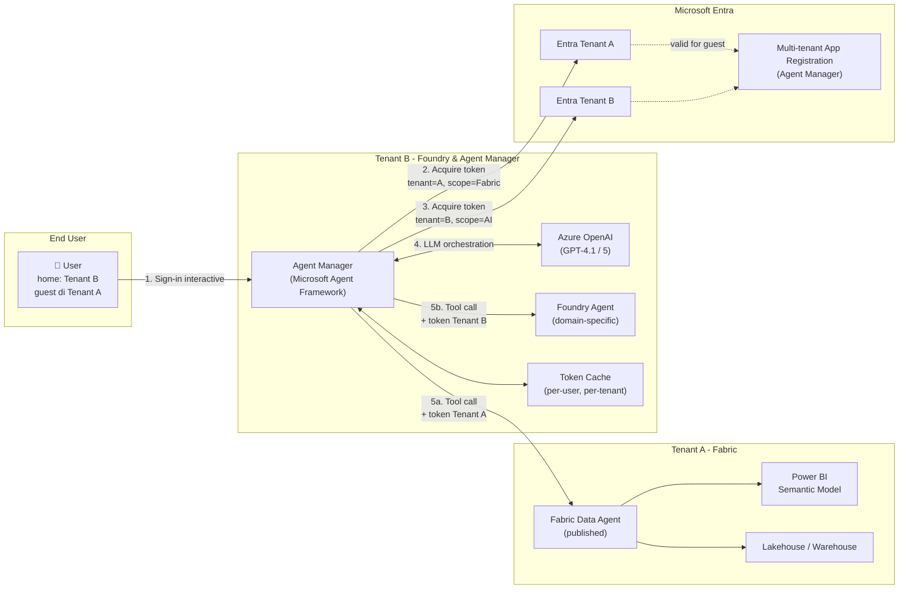
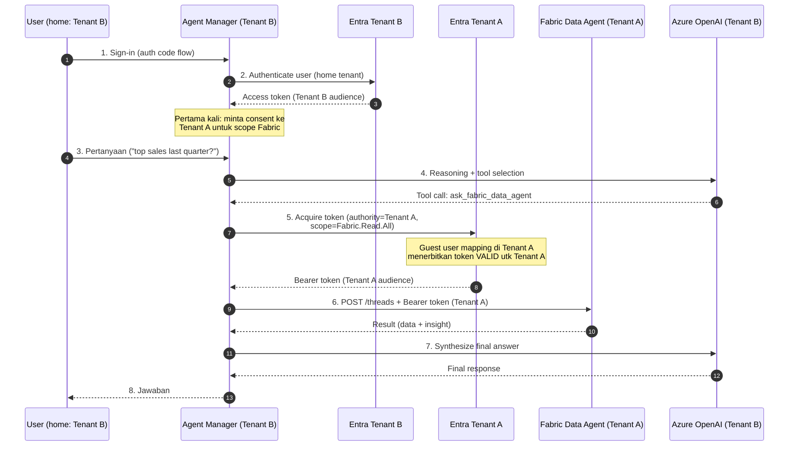
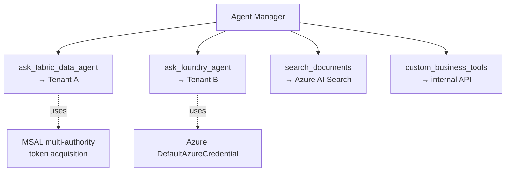
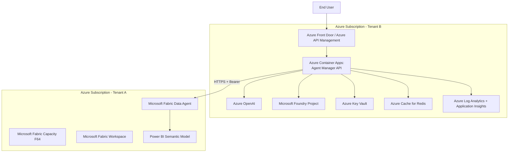

# Proposal: Agent Manager untuk Memanggil Microsoft Fabric Data Agent & Azure AI Foundry Agent (Cross Tenant)

> ## ⚠️ Disclaimer
>
> Dokumen ini adalah **proposal teknis independen** dan **bukan dokumentasi resmi Microsoft**. Tujuannya adalah membantu tim teknis memahami opsi arsitektur untuk skenario lintas-tenant antara Microsoft Fabric dan Azure AI Foundry.
>
> Hal-hal yang perlu diperhatikan sebelum mengimplementasikan:
>
> 1. **Layanan dapat berubah.** Microsoft Fabric Data Agent, Azure AI Foundry, dan Microsoft Agent Framework masih aktif dikembangkan; sebagian fitur masih berstatus *preview*. *Endpoint*, format respons, kelas Software Development Kit (SDK), bahkan persyaratan autentikasi dapat berubah sewaktu-waktu. **Selalu validasi ulang ke [Microsoft Learn](https://learn.microsoft.com/) versi terbaru** sebelum implementasi produksi.
> 2. **Sampel kode bersifat ilustratif.** Contoh kode Python di dokumen ini telah divalidasi terhadap *Microsoft Agent Framework Python 1.0.0rc6 (Januari 2026)* dan *Microsoft Authentication Library (MSAL) Python* per Mei 2026, namun tetap perlu disesuaikan dengan konteks, kebijakan keamanan, dan kebutuhan organisasi Anda.
> 3. **Bukan jaminan dukungan resmi.** Skema On-Behalf-Of lintas tenant memerlukan konfigurasi tambahan di kedua tenant (multi-tenant *Application Registration*, *admin consent*, *Cross-Tenant Access Settings*, user *guest*). Jika salah satu prasyarat tidak terpenuhi, alur dapat gagal — dan tidak semua kombinasi dijamin disupport oleh Microsoft Support.
> 4. **Tanggung jawab keamanan & compliance.** Penerapan di lingkungan produksi adalah tanggung jawab pembaca. Tinjau ulang aspek *Conditional Access*, *Data Loss Prevention*, *audit logging*, *secret management*, serta peraturan privasi data (mis. GDPR, UU PDP) yang berlaku di organisasi Anda.
> 5. **Tidak ada afiliasi.** Penulis bukan perwakilan resmi Microsoft. Seluruh nama produk, logo, dan merek dagang adalah milik pemilik masing-masing.
>
> **Disarankan**: lakukan *Proof of Concept* terbatas dengan tim Identity, Data Platform, dan Security organisasi Anda sebelum melakukan *roll-out* lebih luas.

---

## 1. Latar Belakang

Saat ini terdapat dua tenant Microsoft Entra yang harus berinteraksi:

- **Tenant A** — host **Microsoft Fabric** (workspace, Power BI semantic model, Fabric Data Agent).
- **Tenant B** — host **Azure AI Foundry** (Agent Service, model deployment).

User dari Tenant B sudah ditambahkan sebagai **guest** di Tenant A dengan peran *Contributor* pada Fabric workspace. User tersebut **berhasil** menggunakan Fabric Data Agent secara langsung di Fabric.

### 1.1 Akar Masalah (terkonfirmasi Microsoft Learn)

Microsoft Learn secara eksplisit menyatakan persyaratan **same-tenant**:

> *"The Fabric data agent and the Foundry resources should be on the **same tenant**, and both Microsoft Fabric and Foundry should be **signed in with the same account**."*
> — [Consume Fabric data agent from Microsoft Foundry Services](https://learn.microsoft.com/fabric/data-science/data-agent-foundry#how-it-works)

> *"Use **user identity authentication**. **Service principal authentication isn't supported** for the Fabric data agent."*
> — [Use the Microsoft Fabric data agent (preview)](https://learn.microsoft.com/azure/foundry/agents/how-to/tools/fabric)

Skema **On-Behalf-Of** (mekanisme di mana satu layanan menukar token user untuk meminta token baru ke layanan lain dengan identitas user yang sama) yang dilakukan Microsoft Foundry meng-issue token untuk Tenant B, sedangkan Microsoft Fabric Data Agent berada di Tenant A — sehingga token ditolak meskipun user adalah *guest* yang valid.

---

## 2. Daftar Singkatan dan Istilah

Untuk menjaga keterbacaan dokumen, berikut daftar lengkap singkatan/istilah teknis yang dipakai. Pada kemunculan pertama di setiap bagian, singkatan akan ditulis kepanjangannya, lalu boleh diringkas pada paragraf-paragraf berikutnya.

| Singkatan | Kepanjangan / Penjelasan |
|-----------|---------------------------|
| **API** | Application Programming Interface — antarmuka pemrograman antar-aplikasi yang umumnya berbentuk panggilan HTTP. |
| **Application Registration** | Pendaftaran aplikasi di Microsoft Entra (Azure Active Directory) yang menghasilkan identitas digital (client ID + secret/certificate) untuk aplikasi. |
| **Azure Container Apps** | Layanan Azure untuk menjalankan aplikasi dalam *container* tanpa mengelola Kubernetes secara langsung. |
| **Azure OpenAI** | Layanan Azure yang menyediakan model bahasa besar dari OpenAI (GPT-4.1, GPT-5, dll) dengan jaminan privasi data Microsoft. |
| **Bearer Token** | Token akses berbasis HTTP header `Authorization: Bearer <token>` yang diterbitkan Microsoft Entra untuk mengakses sumber daya yang dilindungi. |
| **B2B (Business-to-Business)** | Mekanisme Microsoft Entra untuk mengundang user dari tenant lain sebagai *guest* di tenant kita. |
| **Conditional Access** | Kebijakan akses Microsoft Entra yang menentukan kondisi (lokasi, perangkat, MFA, dll) sebelum user diizinkan mengakses sumber daya. |
| **Confidential Client** | Aplikasi yang dapat menyimpan rahasia (client secret atau certificate) dengan aman, biasanya berjalan di server. |
| **Cross-Tenant Access Settings** | Konfigurasi Microsoft Entra yang mengatur akses *inbound* dan *outbound* antara dua tenant. |
| **CRUD** | Create, Read, Update, Delete — operasi dasar terhadap data. |
| **DAX (Data Analysis Expressions)** | Bahasa formula untuk Power BI semantic model. |
| **Delegated Permission** | Izin akses yang diberikan kepada aplikasi untuk bertindak **atas nama user** yang sedang sign-in. |
| **Foundry Agent** | Agen AI yang dibuat melalui layanan Microsoft Foundry Agent Service. |
| **GA (Generally Available)** | Status layanan yang sudah resmi rilis (bukan *preview*). |
| **Guest user** | User dari tenant lain yang diundang ke tenant kita lewat B2B; bukan karyawan organisasi pemilik tenant. |
| **Home Tenant** | Tenant Microsoft Entra tempat akun user berada secara *autoritatif*. |
| **Inbound (Cross-tenant)** | Arah akses **masuk** ke tenant kita dari tenant lain. |
| **JWT (JSON Web Token)** | Format token akses standar industri yang dipakai Microsoft Entra. |
| **KQL (Kusto Query Language)** | Bahasa query untuk Eventhouse / Real-Time Intelligence Fabric. |
| **LLM (Large Language Model)** | Model bahasa besar seperti GPT-4.1, GPT-5, Claude Sonnet, dll. |
| **MCP (Model Context Protocol)** | Standar terbuka yang memungkinkan agen AI memanggil alat eksternal (database, API, dll) secara konsisten. |
| **MFA (Multi-Factor Authentication)** | Verifikasi tambahan (mis. SMS, app authenticator) selain password. |
| **MSAL (Microsoft Authentication Library)** | Library resmi Microsoft untuk akuisisi token Microsoft Entra (tersedia untuk Python, .NET, Java, JavaScript, dll). |
| **NL2SQL (Natural Language to SQL)** | Konversi pertanyaan bahasa alami menjadi SQL. |
| **OBO (On-Behalf-Of)** | Alur OAuth 2.0 di mana satu layanan menukar token user yang diterimanya menjadi token baru untuk memanggil layanan downstream **dengan identitas user yang sama**. |
| **OIDC (OpenID Connect)** | Lapisan identitas di atas OAuth 2.0 untuk autentikasi. |
| **Power BI Semantic Model** | Model data Power BI (sebelumnya disebut *dataset*). |
| **Public Client** | Aplikasi yang **tidak** dapat menyimpan rahasia dengan aman (mis. desktop app, mobile app); biasanya pakai PKCE. |
| **PKCE (Proof Key for Code Exchange)** | Mekanisme proteksi alur OAuth 2.0 untuk *public client* terhadap serangan *authorization code interception*. |
| **POC (Proof of Concept)** | Implementasi awal untuk membuktikan ide secara teknis. |
| **MVP (Minimum Viable Product)** | Versi paling minimal namun sudah dapat dipakai end-user. |
| **REST API** | Gaya arsitektur API yang berbasis HTTP + JSON. |
| **Resource Tenant** | Tenant Microsoft Entra yang **memiliki** sumber daya (mis. Tenant A pemilik Fabric). |
| **RTI (Real-Time Intelligence)** | Layanan Fabric untuk pemrosesan data streaming/real-time. |
| **SDK (Software Development Kit)** | Kumpulan library + dokumentasi yang memudahkan integrasi suatu layanan. |
| **Service Principal** | Identitas keamanan untuk aplikasi/script di Microsoft Entra (bukan untuk user manusia). |
| **SKU (Stock Keeping Unit)** | Tier kapasitas/lisensi sebuah produk Microsoft (mis. Fabric F2, F8, F64). |
| **SPA (Single Page Application)** | Aplikasi web di mana navigasi dilakukan tanpa reload halaman. |
| **TLS (Transport Layer Security)** | Protokol enkripsi yang dipakai oleh HTTPS. |
| **Tenant** | Instance terpisah Microsoft Entra (Azure AD) yang memuat user, grup, dan aplikasi sebuah organisasi. |
| **UI (User Interface)** | Antarmuka pengguna. |
| **UX (User Experience)** | Pengalaman pengguna. |
| **User Assertion** | Token akses yang diterima oleh layanan middle-tier dari user, lalu dipakai sebagai input alur **On-Behalf-Of**. |

---

## 3. Tujuan Solusi

1. Memungkinkan **Agent Manager** (orchestrator / pengatur alur) memanggil:
   - Microsoft Fabric Data Agent di **Tenant A**.
   - Azure AI Foundry Agent di **Tenant B**.
2. Tetap memenuhi persyaratan resmi Microsoft (autentikasi user-delegated atau On-Behalf-Of; **Service Principal tidak didukung** untuk Microsoft Fabric Data Agent).
3. Memberi pengalaman tunggal bagi end-user (satu percakapan, sumber data jamak).
4. Memenuhi prinsip *least-privilege* (akses minimum yang diperlukan) dan jejak audit (audit trail) penuh.

---

## 4. Opsi Solusi (Ringkas)

| # | Opsi | Effort | Resmi didukung? | Rekomendasi |
|---|------|--------|-----------------|-------------|
| 1 | **Pindahkan Microsoft Foundry ke Tenant A** | Rendah | ✅ Ya | **Pilihan utama** kalau memungkinkan |
| 2 | **Pindahkan Microsoft Fabric ke Tenant B** | Tinggi (migrasi data) | ✅ Ya | Tidak praktis untuk Fabric existing |
| 3a | **Custom Agent Manager (Microsoft Agent Framework) memanggil Microsoft Fabric Data Agent melalui Model Context Protocol (MCP) server** — Microsoft Fabric Data Agent meng-*expose* dirinya sebagai MCP server (preview) | **Rendah–Medium** | ✅ Ya, sesuai pola resmi MCP + Microsoft Agent Framework | **🎯 Pilihan utama jika Microsoft Foundry tetap di Tenant B** |
| 3b | Custom Agent Manager melalui **Assistants API published URL** (pola lama) | Medium | ✅ Sesuai SDK resmi | Alternatif jika MCP belum tersedia/diaktifkan |
| 4 | Service Principal di Tenant A | — | ❌ **Tidak didukung Microsoft Fabric Data Agent** | Tidak boleh dipakai |

**Proposal utama:** **Opsi 3a** — *Custom Agent Manager* berbasis **Microsoft Agent Framework** yang mengkonsumsi **Microsoft Fabric Data Agent sebagai MCP (Model Context Protocol) server**. Pendekatan ini menyelaraskan dua kapabilitas resmi:
- Microsoft Fabric Data Agent dapat di-*expose* sebagai **MCP server** ([dokumentasi](https://learn.microsoft.com/fabric/data-science/data-agent-mcp-server)).
- Microsoft Agent Framework menyediakan **MCP client** built-in (`MCPStreamableHTTPTool` di Python, `McpClientFactory` di .NET) ([dokumentasi](https://learn.microsoft.com/agent-framework/agents/tools/local-mcp-tools)).

---

## 5. Arsitektur yang Diusulkan

### 5.1 Diagram Arsitektur Tinggi



### 5.2 Komponen Utama

| Komponen | Letak | Peran |
|---|---|---|
| **Agent Manager** | Tenant B (Azure App Service / Azure Container Apps) | Orchestrator utama, registrasi tools, panggil LLM, kelola percakapan |
| **Microsoft Agent Framework** | Library di Agent Manager | Framework agent + helper Microsoft Authentication Library (MSAL) untuk On-Behalf-Of |
| **Azure OpenAI** | Tenant B | Large Language Model (LLM) untuk *reasoning* dan generasi jawaban |
| **Foundry Agent** | Tenant B | Sub-agent untuk domain spesifik (opsional) |
| **Microsoft Fabric Data Agent** | Tenant A (endpoint sudah di-*publish*) | Konversi pertanyaan bahasa alami menjadi query (SQL / DAX / KQL) ke data Fabric |
| **Multi-tenant Application Registration** | Microsoft Entra (multi-tenant) | Identitas Agent Manager untuk akuisisi token di kedua tenant |
| **Token Cache** | Azure Cache for Redis / memori | Cache token per-user agar tidak perlu *prompt* sign-in berulang |

---

## 6. Alur Autentikasi Lintas Tenant



**Kunci keberhasilan:**
- Token diakuisisi dengan parameter `authority=https://login.microsoftonline.com/<TENANT_A_ID>` (artinya “terbitkan token oleh Tenant A”).
- *Scope*: gunakan **Microsoft Fabric service scope** sesuai [Fabric REST API scopes](https://learn.microsoft.com/rest/api/fabric/articles/scopes), contoh `https://api.fabric.microsoft.com/.default` (atau *scope* spesifik seperti `Item.Execute.All` / `Workspace.Read.All`).
- Application Registration **multi-tenant** + **admin consent (persetujuan admin) di Tenant A**.
- User **tetap** sebagai *guest* dengan izin Read pada Microsoft Fabric Data Agent + izin **Build** pada Power BI semantic model (Read saja tidak cukup).

> **Catatan validasi (Microsoft Learn):**
>
> 1. Microsoft Fabric Data Agent endpoint dibangun di atas pola **OpenAI Assistants API** ([Fabric Data Agent SDK](https://learn.microsoft.com/fabric/data-science/fabric-data-agent-sdk), [Python client SDK](https://learn.microsoft.com/fabric/data-science/consume-data-agent-python)). Bearer token harus *user-delegated* (bukan Service Principal). *Scope* yang tepat dapat dikonfirmasi dengan menangkap header `WWW-Authenticate` dari respons error Fabric atau melihat *scope* yang digunakan oleh paket `fabric-data-agent-sdk`.
>
> 2. **Cross-tenant On-Behalf-Of memiliki batasan**. Agar `acquire_token_on_behalf_of` lintas tenant berhasil, perlu dipenuhi syarat-syarat berikut secara kumulatif:
>    - Application Registration adalah **multi-tenant** dan service principal-nya sudah **di-provision** di Tenant A (lihat [Cross-tenant authorization with Microsoft Entra](https://learn.microsoft.com/azure/azure-signalr/signalr-howto-authorize-cross-tenant)).
>    - **Admin consent eksplisit di Tenant A** untuk seluruh delegated permission yang dipakai aplikasi.
>    - **Cross-Tenant Access Settings inbound** di Tenant A mengizinkan aplikasi ini.
>    - User adalah *guest* aktif di Tenant A.
>
>    Bila salah satu syarat tidak terpenuhi dan OBO ditolak, opsi *fallback* yang divalidasi adalah: gunakan **Authorization Code flow** atau **Device Code flow** dengan `authority=https://login.microsoftonline.com/<TENANT_A_ID>` sehingga user sign-in langsung ke Tenant A. Pola ini juga didokumentasikan pada file alternatif [alternative-simple-agent-manager.md](alternative-simple-agent-manager.md).

---

## 7. Detail Implementasi

### 7.1 Prasyarat

#### Di Tenant B (Agent Manager)
- Azure App Service / Azure Container Apps untuk meng-host Agent Manager.
- Azure OpenAI deployment (mis. `gpt-4.1`).
- (Opsional) Microsoft Foundry project + Foundry Agent jika butuh sub-agent terstruktur.
- Azure Cache for Redis / Azure Cosmos DB untuk *session store* dan *token cache*.

#### Di Tenant A (Microsoft Fabric)
- Microsoft Fabric Capacity SKU F2 atau lebih besar ([Fabric features parity](https://learn.microsoft.com/fabric/enterprise/fabric-features)).
- Fabric Workspace + **Microsoft Fabric Data Agent yang sudah di-*publish***.
- *Tenant settings* aktif:
  - *Users can use Copilot and other features powered by Azure OpenAI*.
  - *Data sent to Azure OpenAI can be processed outside your capacity's geographic region* (jika Fabric Capacity berada di region Asia Tenggara, misal Indonesia / Singapura).
  - Lihat [Configure Fabric data agent tenant settings](https://learn.microsoft.com/fabric/data-science/data-agent-tenant-settings).

#### Di Microsoft Entra
- **Application Registration** (di Tenant B) bertipe **multi-tenant** dengan:
  - Redirect URI Agent Manager.
  - Delegated API permissions:
    - `https://api.fabric.microsoft.com/.default` (untuk Microsoft Fabric Data Agent)
    - `https://ai.azure.com/.default` (untuk Microsoft Foundry, jika dipakai)
  - **Admin consent (persetujuan admin)** dilakukan di **Tenant A** oleh Global Administrator Tenant A:
    `https://login.microsoftonline.com/<TENANT_A_ID>/adminconsent?client_id=<APP_ID>`
- **Cross-Tenant Access Settings** (Tenant A → Inbound):
  - Izinkan *delegated access* dari aplikasi Tenant B.
  - Izinkan kolaborasi B2B (Business-to-Business) untuk grup user yang relevan.

#### Izin User (User Permissions)
| Tempat | Peran/Izin |
|---|---|
| Microsoft Entra Tenant A (sebagai *guest*) | Anggota grup B2B |
| Microsoft Fabric Workspace | Contributor (sudah ada) |
| Microsoft Fabric Data Agent | Akses Read |
| Power BI Semantic Model | **Build** (Read saja tidak cukup) |

Sumber: [Use the Microsoft Fabric data agent – Prerequisites](https://learn.microsoft.com/azure/foundry/agents/how-to/tools/fabric#prerequisites)

### 7.2 Tools yang Dipasang di Agent Manager



### 7.3 Skeleton Kode Python

> **Catatan penting:** semua contoh berikut sudah disesuaikan dengan Microsoft Agent Framework Python **versi 1.0.0rc6 (Januari–Mei 2026)** yang menghapus namespace `agent_framework.azure.AzureOpenAIChatClient`. Lihat [Python 2026 Significant Changes Guide](https://learn.microsoft.com/agent-framework/support/upgrade/python-2026-significant-changes).

#### 7.3.1 Akuisisi Token (MSAL, On-Behalf-Of lintas tenant)

```python
import os
from msal import ConfidentialClientApplication

TENANT_A_ID = os.environ["TENANT_A_ID"]
APP_CLIENT_ID = os.environ["APP_CLIENT_ID"]
APP_CLIENT_SECRET = os.environ["APP_CLIENT_SECRET"]


def acquire_fabric_token_for_user(user_assertion: str) -> str:
    """On-Behalf-Of exchange:
    user assertion (token Tenant B) -> token baru dengan audience Microsoft Fabric (Tenant A).

    Prasyarat agar berhasil:
    1. Application Registration adalah multi-tenant.
    2. Admin consent sudah dilakukan di Tenant A.
    3. Cross-Tenant Access Settings inbound di Tenant A mengizinkan aplikasi ini.
    4. User adalah guest aktif di Tenant A.
    """
    app = ConfidentialClientApplication(
        client_id=APP_CLIENT_ID,
        client_credential=APP_CLIENT_SECRET,
        authority=f"https://login.microsoftonline.com/{TENANT_A_ID}",
    )
    result = app.acquire_token_on_behalf_of(
        user_assertion=user_assertion,
        scopes=["https://api.fabric.microsoft.com/.default"],
    )
    if "access_token" not in result:
        raise RuntimeError(f"Token acquisition failed: {result}")
    return result["access_token"]
```

#### 7.3.2 Microsoft Fabric Data Agent Tool — Opsi A: melalui Model Context Protocol (⭐ disarankan, preview)

Microsoft Fabric Data Agent dapat di-*publish* sebagai **Model Context Protocol (MCP) server** (HTTP / Streamable) langsung dari User Interface Fabric (Settings → tab *Model Context Protocol*). Microsoft Agent Framework dapat mengkonsumsinya dengan `MCPStreamableHTTPTool` dan menyuntikkan bearer token (Tenant A) lewat parameter `header_provider` — sesuai panduan resmi: *“For authenticated HTTP endpoints, prefer `header_provider` together with `function_invocation_kwargs` so secrets stay in runtime context.”* ([dokumentasi](https://learn.microsoft.com/agent-framework/agents/tools/local-mcp-tools)).

```python
# Instalasi paket Python:
#   pip install agent-framework agent-framework-openai "mcp --pre" python-dotenv msal

import os
from dotenv import load_dotenv
from agent_framework import ChatAgent, MCPStreamableHTTPTool
from agent_framework.openai import OpenAIChatCompletionClient
from azure.identity import AzureCliCredential

# Microsoft Agent Framework TIDAK memuat .env secara otomatis. Wajib panggil load_dotenv().
load_dotenv()

FABRIC_MCP_URL = os.environ["FABRIC_DATA_AGENT_MCP_URL"]  # dari Fabric Settings > tab MCP


async def fabric_auth_headers() -> dict[str, str]:
    # user_assertion didapat dari middleware request (lihat 7.3.1).
    # Untuk demo lokal, ganti dengan akuisisi token interactive.
    user_assertion = os.environ["DEMO_USER_ASSERTION"]
    token = acquire_fabric_token_for_user(user_assertion)
    return {"Authorization": f"Bearer {token}"}


# Microsoft Agent Framework 1.0.0rc6: namespace baru
# `agent_framework.openai.OpenAIChatCompletionClient` dengan routing Azure eksplisit.
chat_client = OpenAIChatCompletionClient(
    azure_endpoint=os.environ["AZURE_OPENAI_ENDPOINT"],
    model=os.environ["AZURE_OPENAI_DEPLOYMENT"],  # parameter `model`, bukan `deployment_name`
    api_version=os.environ["AZURE_OPENAI_API_VERSION"],
    credential=AzureCliCredential(),
)

fabric_mcp = MCPStreamableHTTPTool(
    name="fabric_data_agent",
    url=FABRIC_MCP_URL,
    header_provider=fabric_auth_headers,  # token diambil per-permintaan, tidak di-bake
    description="Microsoft Fabric Data Agent (Tenant A) untuk pertanyaan data enterprise.",
)

async def main() -> None:
    async with fabric_mcp:
        manager = ChatAgent(
            chat_client=chat_client,
            name="agent-manager",
            instructions=(
                "You are an enterprise assistant. Use the Fabric data agent MCP tool "
                "for any question about sales, customers, or products."
            ),
            tools=fabric_mcp,
        )
        result = await manager.run("Top 10 products by sales order quantity?")
        print(result)

import asyncio
asyncio.run(main())
```

**Mengapa Model Context Protocol unggul untuk skenario ini:**
- *Tool discovery* otomatis (agen tahu apa saja yang bisa dilakukan Microsoft Fabric Data Agent tanpa perlu *hard-code*).
- Header per-permintaan → cocok dengan token lintas tenant per-user.
- Standar terbuka, kompatibel dengan VS Code GitHub Copilot, Claude, Microsoft Foundry hosted MCP, dan lain-lain.
- Pola yang sama dapat dipakai untuk **Fabric Core MCP Server** ([dokumentasi](https://learn.microsoft.com/rest/api/fabric/articles/mcp-servers/core-remote/overview-core-mcp-server)) untuk operasi workspace / items, dan **Fabric Real-Time Intelligence (RTI) MCP** ([dokumentasi](https://learn.microsoft.com/fabric/real-time-intelligence/mcp-overview)) untuk Eventhouse / KQL.

> **Catatan preview:** Microsoft Fabric Data Agent MCP server saat ini berstatus **preview** dan secara resmi diuji di **VS Code**; konsumsi dari MCP client kustom (termasuk Microsoft Agent Framework) didukung selama autentikasi diset dengan benar. Lihat [Consume Fabric data agent as a Model Context Protocol server](https://learn.microsoft.com/fabric/data-science/data-agent-mcp-server).

#### 7.3.3 Microsoft Fabric Data Agent Tool — Opsi B: melalui Assistants API (fallback)

Gunakan paket **`fabric-data-agent-sdk`** ([referensi](https://learn.microsoft.com/fabric/data-science/fabric-data-agent-sdk)) atau pola **published-URL** ([referensi](https://learn.microsoft.com/fabric/data-science/data-agent-end-to-end-tutorial#use-the-fabric-data-agent-programmatically)). Pola ini dipakai jika Model Context Protocol belum tersedia atau aplikasi membutuhkan kontrol *thread* eksplisit:

```python
from openai import OpenAI  # Microsoft Fabric Data Agent kompatibel dengan Assistants API

FABRIC_AGENT_URL = os.environ["FABRIC_DATA_AGENT_PUBLISHED_URL"]
FABRIC_AGENT_ID = os.environ["FABRIC_AGENT_ID"]

def ask_fabric_data_agent(question: str, user_assertion: str) -> str:
    token = acquire_fabric_token_for_user(user_assertion)
    client = OpenAI(
        base_url=FABRIC_AGENT_URL,
        api_key=token,  # bearer token (audience Tenant A)
    )
    thread = client.beta.threads.create()
    client.beta.threads.messages.create(
        thread_id=thread.id, role="user", content=question
    )
    run = client.beta.threads.runs.create_and_poll(
        thread_id=thread.id, assistant_id=FABRIC_AGENT_ID
    )
    msgs = client.beta.threads.messages.list(thread_id=thread.id)
    return msgs.data[0].content[0].text.value
```

#### 7.3.4 Microsoft Agent Framework — Orchestrator dengan tool fungsional

Pola resmi sesuai [Microsoft Agent Framework Overview](https://learn.microsoft.com/agent-framework/overview/). Microsoft Agent Framework menerima fungsi Python biasa sebagai *tool* — *docstring* fungsi otomatis menjadi deskripsi tool yang dilihat Large Language Model.

```python
# pip install agent-framework agent-framework-openai python-dotenv msal

import os
import asyncio
from typing import Annotated
from dotenv import load_dotenv
from pydantic import Field
from agent_framework import ChatAgent
from agent_framework.openai import OpenAIChatCompletionClient
from azure.identity import AzureCliCredential

load_dotenv()  # Microsoft Agent Framework tidak memuat .env otomatis.


def fabric_query(
    question: Annotated[str, Field(description="Pertanyaan user dalam bahasa alami.")],
) -> str:
    """Query enterprise data via Microsoft Fabric Data Agent (sales, customers, products)."""
    user_assertion = get_current_user_token()  # diambil dari middleware request
    return ask_fabric_data_agent(question, user_assertion)


chat_client = OpenAIChatCompletionClient(
    azure_endpoint=os.environ["AZURE_OPENAI_ENDPOINT"],
    model=os.environ["AZURE_OPENAI_DEPLOYMENT"],
    api_version=os.environ["AZURE_OPENAI_API_VERSION"],
    credential=AzureCliCredential(),
)

manager = ChatAgent(
    chat_client=chat_client,
    name="agent-manager",
    instructions=(
        "You are an enterprise assistant. "
        "For any question about sales orders, customers, or products, "
        "call the `fabric_query` tool."
    ),
    tools=fabric_query,  # fungsi Python langsung dipakai sebagai tool
)

async def main() -> None:
    result = await manager.run("Show top 10 products by sales order quantity.")
    print(result)

asyncio.run(main())
```

> **Catatan validasi (Mei 2026):**
> 1. Kelas dan path import berikut dikonfirmasi terhadap dokumentasi Microsoft Learn versi terbaru: `ChatAgent` dari `agent_framework`, `MCPStreamableHTTPTool` dari `agent_framework`, `OpenAIChatCompletionClient` dari `agent_framework.openai`. Versi sebelumnya menggunakan `agent_framework.azure.AzureOpenAIChatClient` yang **sudah dihapus** — lihat [Python 2026 Significant Changes Guide](https://learn.microsoft.com/agent-framework/support/upgrade/python-2026-significant-changes).
> 2. `acquire_token_on_behalf_of` lintas tenant **memerlukan**: Application Registration multi-tenant + admin consent di Tenant A + *Cross-Tenant Access Settings* inbound yang mengizinkan aplikasi. Bila On-Behalf-Of ditolak, *fallback* ke **Device Code flow** atau **Authorization Code flow interactive** dengan target `tenant=TENANT_A_ID` (lihat [alternative-simple-agent-manager.md](alternative-simple-agent-manager.md)).
> 3. Gunakan **token cache per-user** (mis. MSAL `SerializableTokenCache` + Azure Cache for Redis) untuk menghindari *prompt sign-in* berulang.
> 4. Untuk orkestrasi multi-agen (mis. Foundry agent sebagai sub-agent), pertimbangkan pola **Handoff / Sequential / Magentic** dari [Agent Framework Workflows Orchestrations](https://learn.microsoft.com/agent-framework/workflows/orchestrations/handoff).
> 5. Microsoft Agent Framework Python **tidak** memuat berkas `.env` secara otomatis. Panggil `load_dotenv()` di awal aplikasi atau set environment variable di shell / IDE.

---

## 8. Pertimbangan Keamanan

| Aspek | Mitigasi |
|---|---|
| Token Tenant A bocor | Token cache memakai *encryption-at-rest* (Azure Cache for Redis dengan Transport Layer Security + kunci Azure Key Vault) |
| Kebocoran data lintas tenant | *Conditional Access* di Tenant A; audit log Microsoft Entra dan Microsoft Fabric Activity Log |
| User non-guest meminta data Fabric | Pengecekan otorisasi di Agent Manager: tolak bila user tidak terdaftar sebagai *guest* di Tenant A |
| Tool injection / prompt injection | Validasi dan sanitasi prompt; gunakan `tool_choice` eksplisit; aktifkan Azure AI Content Safety |
| Jejak audit (audit trail) | Log per permintaan: `userPrincipalName`, ID tenant, nama tool, `workspace_id`, `artifact_id` Fabric |
| Manajemen rahasia (secret management) | *Client secret* Application Registration disimpan di **Azure Key Vault** dan diambil melalui *Managed Identity* Agent Manager |

---

## 9. Topologi Deployment



---

## 10. Roadmap & Milestones

| Fase | Aktivitas | Output |
|---|---|---|
| **Fase 0 — Discovery** | Validasi *Cross-Tenant Access Settings*, inventaris user *guest*, validasi Microsoft Fabric Data Agent yang sudah di-*publish* | Decision document |
| **Fase 1 — Proof of Concept (POC)** | Skrip Python lokal: Device Code flow → token Tenant A → panggil Microsoft Fabric Data Agent | Notebook yang berfungsi |
| **Fase 2 — Agent Manager Minimum Viable Product (MVP)** | Microsoft Agent Framework + 1 tool (Microsoft Fabric) + Azure OpenAI sebagai Large Language Model | API endpoint |
| **Fase 3 — Multi-tool** | Tambah Foundry sub-agent, Azure AI Search, *custom tools* | API siap produksi |
| **Fase 4 — Hardening** | Azure Key Vault, *Conditional Access*, *audit logging*, *rate limiting* | Go-live |
| **Fase 5 — Scale** | Multi-region, *autoscale*, *session store* di Azure Cosmos DB | Enterprise rollout |

---

## 11. Risiko & Mitigasi

| Risiko | Dampak | Mitigasi |
|---|---|---|
| *Cross-Tenant Access Settings* diblokir admin Tenant A | Akuisisi token gagal | Koordinasi awal dengan Identity Administrator Tenant A |
| Microsoft Fabric Data Agent masih *preview* | Endpoint / format respons dapat berubah | *Pin* versi SDK, monitor *release notes* |
| On-Behalf-Of lintas tenant memerlukan *consent* eksplisit | Gagal di produksi | Lakukan admin consent di Tenant A sebelum *go-live* |
| User *guest* dihapus dari Tenant A | Pemanggilan tool gagal | *Lifecycle management* user *guest* + alerting |
| Service Principal tidak didukung Microsoft Fabric Data Agent | Tidak bisa *scheduled* / *headless* | Gunakan *delegated user* untuk job interaktif; untuk *headless* panggil API Fabric lain (REST OneLake / SQL endpoint) dengan Service Principal |
| Latensi akuisisi token lintas tenant | Pengalaman pengguna lambat | *Token caching* per-user (TTL ≤ 1 jam) |

---

## 12. Kesimpulan

Arsitektur **Agent Manager berbasis Microsoft Agent Framework di Tenant B** dengan **akuisisi token *delegated* / On-Behalf-Of ke Tenant A** adalah solusi yang:

1. ✅ **Mengatasi keterbatasan lintas tenant** dari Microsoft Foundry ke Microsoft Fabric Data Agent.
2. ✅ **Tetap memenuhi persyaratan resmi Microsoft** (identitas user, *Service Principal* tidak dipakai untuk Microsoft Fabric Data Agent).
3. ✅ **Fleksibel** untuk menambah sumber data jamak (Foundry sub-agent, Azure AI Search, REST API internal).
4. ✅ **Auditable** dengan Microsoft Entra dan Microsoft Fabric Activity Log.

Catatan penting: bila secara organisasi Microsoft Foundry **dapat** dipindah ke Tenant A, itu tetap solusi paling sederhana dan paling terdokumentasi resmi. *Custom* Agent Manager direkomendasikan jika pemisahan tenant adalah kendala bisnis / keamanan yang tidak bisa diubah. Untuk pengguna yang ingin solusi lebih ringan, lihat juga file [alternative-simple-agent-manager.md](alternative-simple-agent-manager.md) yang menyajikan dua alternatif lebih sederhana namun tetap aman.

---

## 13. Referensi (Microsoft Learn)

### Fabric Data Agent
- [Consume Fabric data agent from Microsoft Foundry Services](https://learn.microsoft.com/fabric/data-science/data-agent-foundry)
- [Use the Microsoft Fabric data agent (preview) — overview & SDKs](https://learn.microsoft.com/azure/foundry/agents/how-to/tools/fabric)
- [Fabric Data Agent end-to-end tutorial (programmatic use)](https://learn.microsoft.com/fabric/data-science/data-agent-end-to-end-tutorial#use-the-fabric-data-agent-programmatically)
- [Consume a Fabric data agent with the Python client SDK](https://learn.microsoft.com/fabric/data-science/consume-data-agent-python)
- [Fabric Data Agent Python SDK (pip: fabric-data-agent-sdk)](https://learn.microsoft.com/fabric/data-science/fabric-data-agent-sdk)
- [Configure Fabric data agent tenant settings](https://learn.microsoft.com/fabric/data-science/data-agent-tenant-settings)
- [Fabric data agent concepts](https://learn.microsoft.com/fabric/data-science/concept-data-agent)
- [Create a Fabric data agent — authentication & tokens](https://learn.microsoft.com/fabric/data-science/how-to-create-data-agent#authentication-and-tokens)
- [Underlying data source permissions](https://learn.microsoft.com/fabric/data-science/data-agent-sharing#underlying-data-source-permissions)

### Microsoft Foundry & Agent Identity
- [Agent identity concepts in Microsoft Foundry](https://learn.microsoft.com/azure/foundry/agents/concepts/agent-identity)
- [Conditional Access for agent identities (OBO flow)](https://learn.microsoft.com/entra/identity/conditional-access/agent-id)

### Microsoft Agent Framework
- [Microsoft Agent Framework — Overview](https://learn.microsoft.com/agent-framework/overview/)
- [Agent Framework — Workflows Orchestrations (Sequential / Concurrent / Handoff / Group Chat / Magentic)](https://learn.microsoft.com/agent-framework/workflows/orchestrations/handoff)
- [Agent Framework — Human-in-the-loop](https://learn.microsoft.com/agent-framework/workflows/human-in-the-loop)
- [Python 2026 Significant Changes Guide (perubahan namespace `agent_framework.azure` → `agent_framework.openai`)](https://learn.microsoft.com/agent-framework/support/upgrade/python-2026-significant-changes)
- [Microsoft Agent Framework — Azure OpenAI Agents (provider page)](https://learn.microsoft.com/agent-framework/agents/providers/azure-openai)
- [Microsoft Agent Framework — OpenAI provider page (Python `OpenAIChatCompletionClient` & `OpenAIChatClient`)](https://learn.microsoft.com/agent-framework/agents/providers/openai)
- [Microsoft Agent Framework — Function Tools (Python)](https://learn.microsoft.com/agent-framework/agents/tools/function-tools)
- [`ChatAgent` Python API reference](https://learn.microsoft.com/python/api/agent-framework-core/agent_framework.chatagent)
- [`MCPStreamableHTTPTool` Python API reference](https://learn.microsoft.com/python/api/agent-framework-core/agent_framework.mcpstreamablehttptool)
- [AutoGen to Microsoft Agent Framework Migration Guide](https://learn.microsoft.com/agent-framework/migration-guide/from-autogen/)
- [Configure your .NET Agent to use OAuth (On-Behalf-Of)](https://learn.microsoft.com/microsoft-365/agents-sdk/agent-oauth-configuration-dotnet)
- [Agent 365 Identity – authentication flows](https://learn.microsoft.com/microsoft-agent-365/developer/identity#authentication-flows)

### Model Context Protocol (MCP)
- [What are Fabric MCP Servers?](https://learn.microsoft.com/rest/api/fabric/articles/mcp-servers/what-is-fabric-mcp-server)
- [Consume Fabric data agent as a Model Context Protocol server (preview)](https://learn.microsoft.com/fabric/data-science/data-agent-mcp-server)
- [Fabric Core MCP Server overview](https://learn.microsoft.com/rest/api/fabric/articles/mcp-servers/core-remote/overview-core-mcp-server)
- [MCP in Real-Time Intelligence (preview)](https://learn.microsoft.com/fabric/real-time-intelligence/mcp-overview)
- [Connect AI Agents to Fabric API for GraphQL with a local MCP server](https://learn.microsoft.com/fabric/data-engineering/api-graphql-local-model-context-protocol)
- [Agent Framework — Using MCP tools with Agents (Local MCP)](https://learn.microsoft.com/agent-framework/agents/tools/local-mcp-tools)
- [Agent Framework — Using MCP tools with Foundry Agents (Hosted MCP)](https://learn.microsoft.com/agent-framework/agents/tools/hosted-mcp-tools)
- [MCP specification — Security Best Practices](https://modelcontextprotocol.io/specification/draft/basic/security_best_practices)
- [Understanding and mitigating security risks in MCP implementations (Microsoft Security Blog)](https://techcommunity.microsoft.com/blog/microsoft-security-blog/understanding-and-mitigating-security-risks-in-mcp-implementations/4404667)

### Fabric REST API & Scopes
- [Fabric REST API scopes](https://learn.microsoft.com/rest/api/fabric/articles/scopes)
- [Fabric Permission model](https://learn.microsoft.com/fabric/security/permission-model)

### Fabric Region & Capacity
- [Fabric region availability](https://learn.microsoft.com/fabric/admin/region-availability)
- [Fabric features parity (SKU)](https://learn.microsoft.com/fabric/enterprise/fabric-features)
- [Find your Fabric home region](https://learn.microsoft.com/fabric/admin/find-fabric-home-region)
- [Connecting to Microsoft OneLake](https://learn.microsoft.com/fabric/onelake/onelake-access-api)

### Microsoft Authentication Library (MSAL) Python
- [Acquire tokens — overview](https://learn.microsoft.com/entra/msal/python/getting-started/acquiring-tokens)
- [Confidential clients — `acquire_token_on_behalf_of`](https://learn.microsoft.com/entra/msal/python/getting-started/acquiring-tokens#confidential-clients-interactive-token-acquisition)
- [`acquire_token_on_behalf_of` API reference (Python)](https://learn.microsoft.com/python/api/msal/msal.application.confidentialclientapplication#msal-application-confidentialclientapplication-acquire-token-on-behalf-of)
- [On-Behalf-Of flow — Microsoft identity platform](https://learn.microsoft.com/entra/identity-platform/v2-oauth2-on-behalf-of-flow)
- [`SerializableTokenCache` — token cache serialization](https://learn.microsoft.com/entra/msal/python/advanced/msal-python-token-cache-serialization)

### Microsoft Entra Cross-Tenant
- [Cross-tenant access overview](https://learn.microsoft.com/entra/external-id/cross-tenant-access-overview)
- [B2B collaboration overview](https://learn.microsoft.com/entra/external-id/what-is-b2b)
- [Configure cross-tenant authorization with Microsoft Entra (Azure SignalR contoh pola)](https://learn.microsoft.com/azure/azure-signalr/signalr-howto-authorize-cross-tenant)
- [Multitenant user management — terminology (resource tenant, home tenant, guest user)](https://learn.microsoft.com/entra/architecture/multi-tenant-user-management-introduction)

---

*Status dokumen: Draft v1.3 — divalidasi ulang terhadap Microsoft Learn (Mei 2026), siap direview.*
